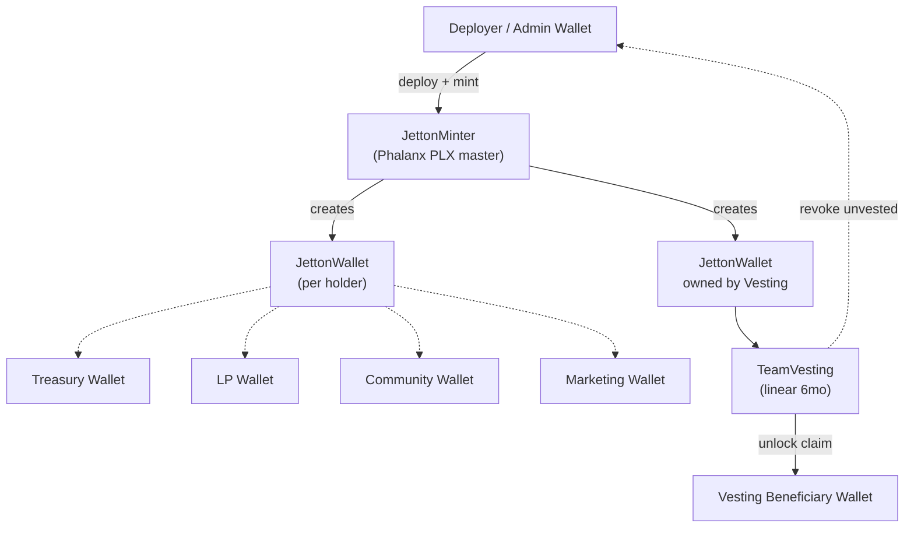
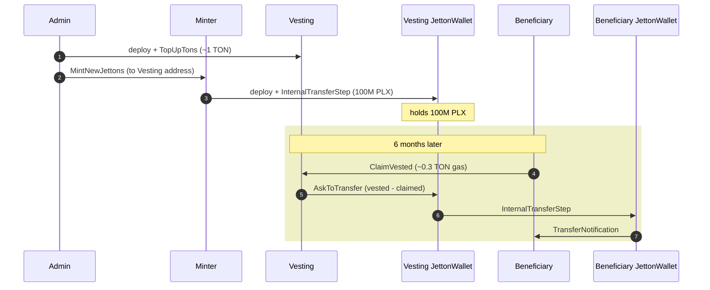
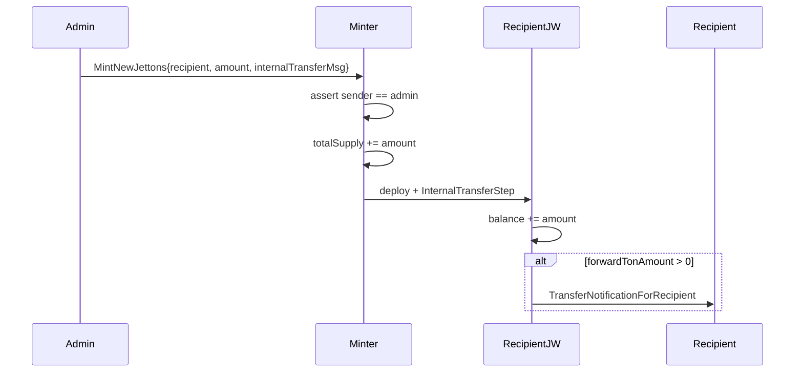
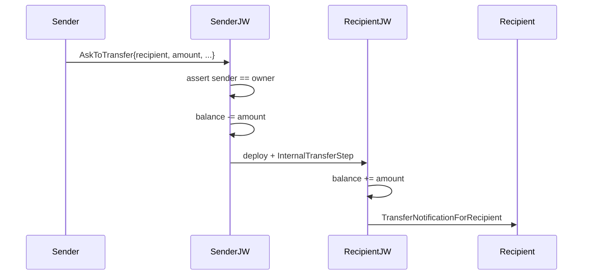
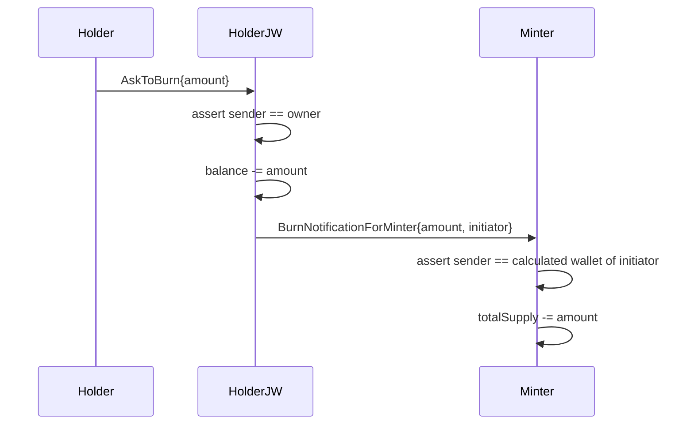

# Architecture

## High-Level Overview



## Contracts

### `JettonMinter` (TEP-74 master)

Standard Jetton minter with:

- **Mint**: admin only, deploys per-holder JettonWallet on demand
- **Discovery**: returns wallet address for any owner
- **Burn handling**: receives `BurnNotificationForMinter` from JettonWallets, decrements `totalSupply`
- **Admin lifecycle**:
  - `ChangeMinterAdmin` (propose) → `ClaimMinterAdmin` (accept) — two-step handover
  - `DropMinterAdmin` — permanently disable minting (recommended after distribution)
- **Metadata**: `ChangeMinterMetadata` to update on-chain dict
- **Upgradeable code**: `UpgradeMinterCode` (admin only); intended for migrations only

Storage: `MinterStorage { totalSupply, adminAddress, nextAdminAddress, metadata }`

### `JettonWallet` (TEP-74 per-holder)

Standard Jetton wallet, deployed per (owner × minter) pair. One wallet per holder.

- **AskToTransfer** (`0x0f8a7ea5`): owner sends jettons to recipient (creates recipient's wallet on the fly)
- **AskToBurn** (`0x595f07bc`): owner burns own jettons (notifies minter)
- **InternalTransferStep** (`0x178d4519`): incoming transfer from another wallet or minter
- **Bounce handling**: restores balance if a transfer fails downstream

Storage: `WalletStorage { jettonBalance, ownerAddress, minterAddress }`

### `TeamVesting` (custom)

Linear time-based vesting contract.



Storage layout (split across cell + ref to fit 1023-bit limit):

```tolk
struct VestingStorage {
    config: Cell<VestingConfig>     // ref-cell with all the immutable params
    claimedAmount: coins             // mutable: tracks claimed
}

struct VestingConfig {
    beneficiary: address
    admin: address
    minterAddress: address
    totalAmount: coins
    startTime: uint32
    duration: uint32
}
```

Calculation:

```
elapsed = blockchain.now() − startTime
vested  = totalAmount × elapsed / duration   (capped at totalAmount)
claimable = vested − claimedAmount
```

Get methods: `get_vesting_data`, `get_vested_amount`, `get_claimable_amount`, `get_claimed_amount`, `get_jetton_wallet_address`.

## Message Flows

### Mint flow (admin → recipient)



### Transfer flow (holder → holder)



### Burn flow (deflation)



## Sharding & Address Derivation

PLX uses **shard depth 8** (`SHARD_DEPTH=8` in `contracts/sharding.tolk`). This means:

- Each holder's `JettonWallet` is deployed on the **same shard prefix** as the holder's wallet.
- Same-shard transfers are cheaper and faster (no cross-shard overhead).
- Address is deterministic: `calcAddressOfJettonWallet(owner, minter, walletCode)`.

## Test Coverage

60 tests across 7 files:

| File | Tests | Focus |
|---|---:|---|
| `admin-and-governance.test.tolk` | 14 | Admin handover, drop, metadata, upgrade, discovery, sharding |
| `bounce-handling.test.tolk` | 3 | Bounce recovery for transfer/burn |
| `gas.test.tolk` | 13 | Gas/fee bounds, edge cases |
| `protocol-validation.test.tolk` | 7 | Reject malformed payloads, unauthorized senders |
| `state-init.test.tolk` | 2 | Max value mint, storage size limits |
| `wallet-behavior.test.tolk` | 9 | Owner transfer, burn, balance checks |
| `vesting.test.tolk` | 12 | Linear release, claim, revoke, time edges |

Run with `acton test`.

## Security Considerations

- **Bounce handling**: All sends use bounce-on-fail to recover state on downstream errors
- **No external calls during state mutation**: storage saved before sends
- **Lazy deserialization**: `lazy AllowedMessageToMinter.fromSlice(...)` validates opcodes
- **Admin two-step**: prevents accidental loss of admin via typo
- **No self-transferable code beyond admin**: `UpgradeMinterCode` is admin-only and intended for migrations only — recommend dropping admin after distribution to make this immutable

## Future Extensions

Out of scope for v1.0.0 but feasible:

- **Staking contract**: emission pool from treasury, lock PLX for yield
- **Buyback contract**: takes TON, swaps to PLX via DEX, burns the PLX (currently done manually)
- **DAO module**: voting on treasury allocations using PLX as voting weight
- **TON Connect dApp**: frontend for users to mint/transfer/swap PLX
