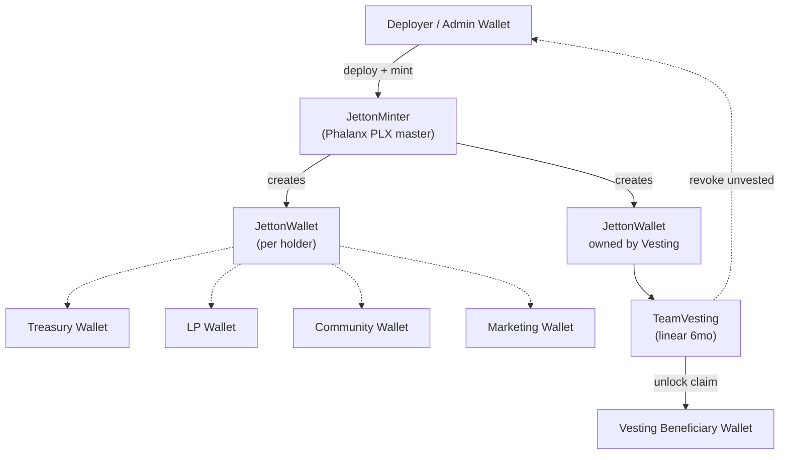
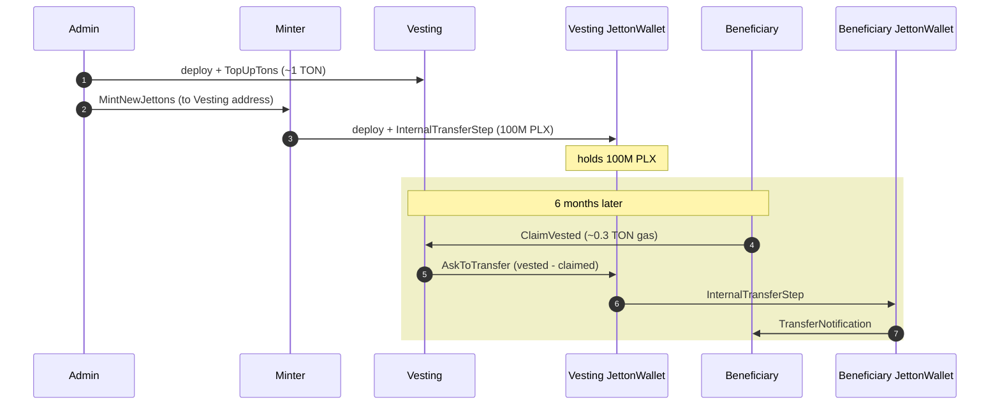
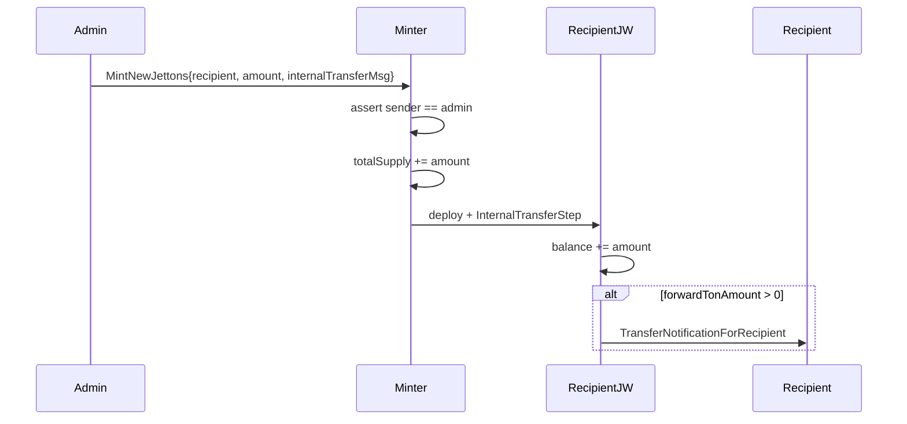
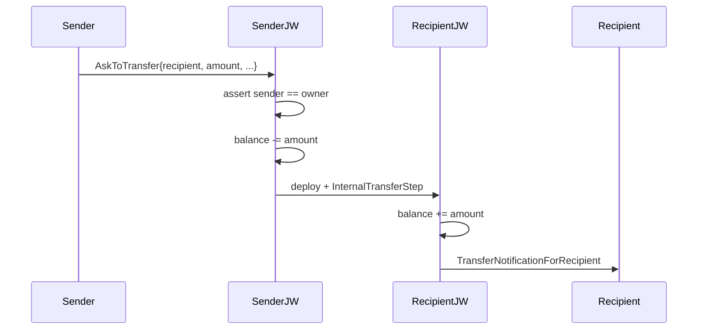
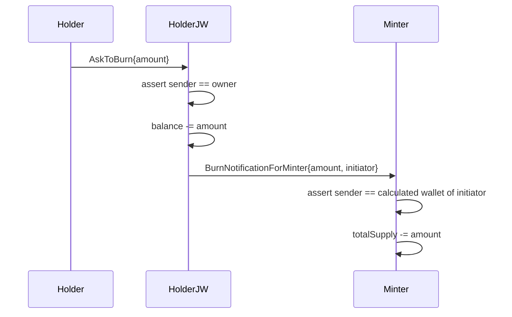

# Architecture

## High-Level Overview


```mermaid
flowchart TB
    Admin["Deployer / Admin Wallet"]
    Beneficiary["Vesting Beneficiary Wallet"]
    Treasury["Treasury Wallet"]
    LP["LP Wallet"]
    Community["Community Wallet"]
    Marketing["Marketing Wallet"]

    Minter["JettonMinter<br/>(Phalanx PLX master)"]
    Vesting["TeamVesting<br/>(linear 6mo)"]
    HolderJW["JettonWallet<br/>(per holder)"]
    VestingJW["JettonWallet<br/>owned by Vesting"]

    Admin -->|"deploy + mint"| Minter
    Minter -->|"creates"| HolderJW
    Minter -->|"creates"| VestingJW
    HolderJW -.-> Treasury
    HolderJW -.-> LP
    HolderJW -.-> Community
    HolderJW -.-> Marketing
    VestingJW --> Vesting
    Vesting -->|"unlock claim"| Beneficiary
    Vesting -.->|"revoke unvested"| Admin
```

## Contracts

### `JettonMinter` (TEP-74 master)

Standard Jetton minter with:

- **Mint**: admin only, deploys per-holder JettonWallet on demand
- **Discovery**: returns wallet address for any owner
- **Burn handling**: receives `BurnNotificationForMinter` from JettonWallets, decrements `totalSupply`
- **Admin lifecycle**:
  - `ChangeMinterAdmin` (propose) → `ClaimMinterAdmin` (accept) — two-step handover
  - `DropMinterAdmin` — permanently disable minting (recommended after distribution)
- **Metadata**: `ChangeMinterMetadata` to update on-chain dict
- **Upgradeable code**: `UpgradeMinterCode` (admin only); intended for migrations only

Storage: `MinterStorage { totalSupply, adminAddress, nextAdminAddress, metadata }`

### `JettonWallet` (TEP-74 per-holder)

Standard Jetton wallet, deployed per (owner × minter) pair. One wallet per holder.

- **AskToTransfer** (`0x0f8a7ea5`): owner sends jettons to recipient (creates recipient's wallet on the fly)
- **AskToBurn** (`0x595f07bc`): owner burns own jettons (notifies minter)
- **InternalTransferStep** (`0x178d4519`): incoming transfer from another wallet or minter
- **Bounce handling**: restores balance if a transfer fails downstream

Storage: `WalletStorage { jettonBalance, ownerAddress, minterAddress }`

### `TeamVesting` (custom)

Linear time-based vesting contract.


```mermaid
sequenceDiagram
    autonumber
    participant Admin
    participant Minter
    participant Vesting
    participant VestingJW as Vesting JettonWallet
    participant Beneficiary
    participant BeneficiaryJW as Beneficiary JettonWallet

    Admin->>Vesting: deploy + TopUpTons (~1 TON)
    Admin->>Minter: MintNewJettons (to Vesting address)
    Minter->>VestingJW: deploy + InternalTransferStep (100M PLX)
    Note over VestingJW: holds 100M PLX

    rect rgb(240, 240, 200)
    Note over Beneficiary,Vesting: 6 months later
    Beneficiary->>Vesting: ClaimVested (~0.3 TON gas)
    Vesting->>VestingJW: AskToTransfer (vested - claimed)
    VestingJW->>BeneficiaryJW: InternalTransferStep
    BeneficiaryJW->>Beneficiary: TransferNotification
    end
```

Storage layout (split across cell + ref to fit 1023-bit limit):

```tolk
struct VestingStorage {
    config: Cell<VestingConfig>     // ref-cell with all the immutable params
    claimedAmount: coins             // mutable: tracks claimed
}

struct VestingConfig {
    beneficiary: address
    admin: address
    minterAddress: address
    totalAmount: coins
    startTime: uint32
    duration: uint32
}
```

Calculation:

```
elapsed = blockchain.now() − startTime
vested  = totalAmount × elapsed / duration   (capped at totalAmount)
claimable = vested − claimedAmount
```

Get methods: `get_vesting_data`, `get_vested_amount`, `get_claimable_amount`, `get_claimed_amount`, `get_jetton_wallet_address`.

## Message Flows

### Mint flow (admin → recipient)


```mermaid
sequenceDiagram
    Admin->>Minter: MintNewJettons{recipient, amount, internalTransferMsg}
    Minter->>Minter: assert sender == admin
    Minter->>Minter: totalSupply += amount
    Minter->>RecipientJW: deploy + InternalTransferStep
    RecipientJW->>RecipientJW: balance += amount
    alt forwardTonAmount > 0
        RecipientJW->>Recipient: TransferNotificationForRecipient
    end
```

### Transfer flow (holder → holder)


```mermaid
sequenceDiagram
    Sender->>SenderJW: AskToTransfer{recipient, amount, ...}
    SenderJW->>SenderJW: assert sender == owner
    SenderJW->>SenderJW: balance -= amount
    SenderJW->>RecipientJW: deploy + InternalTransferStep
    RecipientJW->>RecipientJW: balance += amount
    RecipientJW->>Recipient: TransferNotificationForRecipient
```

### Burn flow (deflation)


```mermaid
sequenceDiagram
    Holder->>HolderJW: AskToBurn{amount}
    HolderJW->>HolderJW: assert sender == owner
    HolderJW->>HolderJW: balance -= amount
    HolderJW->>Minter: BurnNotificationForMinter{amount, initiator}
    Minter->>Minter: assert sender == calculated wallet of initiator
    Minter->>Minter: totalSupply -= amount
```

## Sharding & Address Derivation

PLX uses **shard depth 8** (`SHARD_DEPTH=8` in `contracts/sharding.tolk`). This means:

- Each holder's `JettonWallet` is deployed on the **same shard prefix** as the holder's wallet.
- Same-shard transfers are cheaper and faster (no cross-shard overhead).
- Address is deterministic: `calcAddressOfJettonWallet(owner, minter, walletCode)`.

## Test Coverage

60 tests across 7 files:

| File | Tests | Focus |
|---|---:|---|
| `admin-and-governance.test.tolk` | 14 | Admin handover, drop, metadata, upgrade, discovery, sharding |
| `bounce-handling.test.tolk` | 3 | Bounce recovery for transfer/burn |
| `gas.test.tolk` | 13 | Gas/fee bounds, edge cases |
| `protocol-validation.test.tolk` | 7 | Reject malformed payloads, unauthorized senders |
| `state-init.test.tolk` | 2 | Max value mint, storage size limits |
| `wallet-behavior.test.tolk` | 9 | Owner transfer, burn, balance checks |
| `vesting.test.tolk` | 12 | Linear release, claim, revoke, time edges |

Run with `acton test`.

## Security Considerations

- **Bounce handling**: All sends use bounce-on-fail to recover state on downstream errors
- **No external calls during state mutation**: storage saved before sends
- **Lazy deserialization**: `lazy AllowedMessageToMinter.fromSlice(...)` validates opcodes
- **Admin two-step**: prevents accidental loss of admin via typo
- **No self-transferable code beyond admin**: `UpgradeMinterCode` is admin-only and intended for migrations only — recommend dropping admin after distribution to make this immutable

## Future Extension Contracts (implemented)

These contracts augment the core jetton system with advanced DeFi capabilities.
They are generic — any user-deployed token can use them, not just PLX.

### `TokenStaking` (generic staking)

APR-accrual staking pool. Token holders transfer jettons to lock for a minimum period;
rewards accrue per-second. Admin funds the reward pool and sets APR.

| Feature | Detail |
|---|---|
| Stake | Transfer jettons with lock duration via `TransferNotification` |
| Unstake | Withdraw principal + pending rewards after lock expires |
| Claim | Harvest rewards without unstaking principal |
| APR | Admin updatable via `UpdateApr` (bps; 500 = 5%) |
| Min lock | Admin-configurable minimum lock duration |

Storage: `StakingStorage { config, totalStaked, rewardPerTokenStored, lastUpdateTime, rewardPool, stakes map }`

### `TokenLockVault` (generic lock vault)

Multi-tier time-locked escrow. Holders lock tokens for a chosen duration tier;
higher tiers earn bonus rewards. Bonuses are paid from a reward pool at unlock.

| Feature | Detail |
|---|---|
| Tiers | Up to 16 tiers, each with duration + bonus bps |
| Sovereign locks | Higher-tier locks with elevated minimum amounts |
| Event end | Campaign deadline — bonus only if unlockAt ≤ eventEndAt |
| Admin | Update tiers, event end, and minimum amounts |

Storage: `LockVaultStorage { config, nextPositionId, totalLocked, rewardPool, positions map }`

### `TokenGovernance` (DAO voting)

Simple proposal-based governance. Admin creates proposals with target contracts
and payloads. Token holders vote for/against. Passed proposals execute after
timelock via direct message send.

| Feature | Detail |
|---|---|
| Proposals | Created by admin with target contract + arbitrary payload |
| Voting | Holders vote For/Against; one vote per address (snapshot-based) |
| Quorum | Configurable % of snapshot balance required |
| Timelock | Delay between vote end and execution |
| Execution | Sends payload to target contract via admin-less `send` |

### `LiquidityLocker` (LP lock)

Locks LP tokens (jetton transfer) for a configurable period. Provides on-chain
proof that liquidity cannot be withdrawn — preventing rug pulls.

| Feature | Detail |
|---|---|
| Lock | Transfer LP tokens with `unlockAt` timestamp via forward payload |
| Unlock | Owner withdraws LP tokens after unlockAt |
| Revoke | Admin can force-release a lock (emergency) |
| Proof | All locks are queryable on-chain via `get_lock` |

### `CustomStakingParams` (parameterized staking)

Extended staking with up to 5 bonus tiers. Same mechanics as basic staking but
effective APR = base apr + highest matching bonus tier (based on stake amount).

### Legacy contracts (PLX-specific only)

Two contracts remain PLX-specific and are **not** exposed in the toolkit build wizard:

| Contract | Generic replacement | Notes |
|---|---|---|
| `PlxStaking.tolk` | `TokenStaking.tolk` | PLX ecosystem staking only |
| `PlxLockVault.tolk` | `TokenLockVault.tolk` | PLX ecosystem lock vault only |

Both are marked `LEGACY` in their source files. User-facing features use the
generic versions (`TokenStaking`, `TokenLockVault`) which accept any TEP-74
jetton minter address.

### Deploy pipeline

- **`deploy-jetton-combo.tolk`** — multi-template deploy script supporting
  standard, antiwhale, fee, staking, and airdrop templates in a single script
- **`deploy_jetton.py`** (API service) — expanded `SUPPORTED_TEMPLATES` to
  `frozenset({"standard", "antiwhale", "fee", "mintable", "staking", "airdrop"})`
