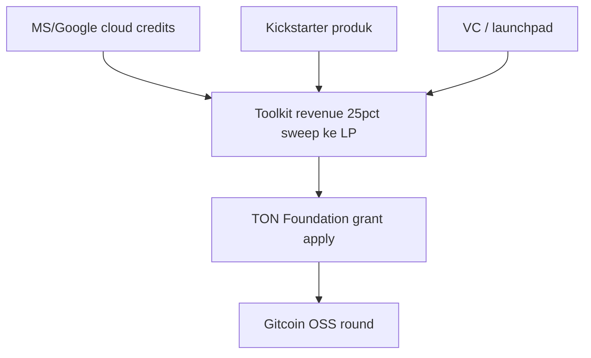

# Penggalangan dana & LP — opsi realistis untuk Phalanx (PLX)

> **Konteks:** LP Ston.fi ~$34 (9.65 TON + 96,500 PLX). PLX **sudah live** mainnet — bukan pre-launch.  
> **Prinsip:** utamakan **produk + hibah ekosistem TON** dan **kredit infra**; hindari narasi investasi PLX yang bentrok compliance.

---

## Ringkasan cepat: 5 kategori yang Anda sebut

| # | Jalur | Cocok PLX/TON sekarang? | Langsung naikkan LP? | Prioritas Phalanx |
|---|--------|-------------------------|----------------------|-------------------|
| 1 | **Launchpad** (Binance, DAO Maker, Polkastarter) | **Rendah** — biasa pre-TGE, chain BNB/ETH; PLX sudah ada | Kadang (IDO) tapi reputasi + legal | **P4** — hanya jika round baru disengaja |
| 2 | **Web3 grants** | **Tinggi** untuk TON + Gitcoin OSS | Indirect (TON/USDC grant) | **P1** |
| 3 | **Crypto VC seed** | **Sedang** — butuh pitch, entity, traction | Equity → ops/LP | **P3** — panjang |
| 4 | **AI dev grants** (Microsoft, Google) | **Tinggi** untuk PLX86 / infra | **Tidak LP** — hemat cloud/GPU | **P2** — parallel |
| 5 | **Kickstarter / Indiegogo** | **Sedang** — jual **Toolkit**, bukan token | Cash → ops/LP | **P2** — produk only |

---

## 1. Crypto launchpads

| Platform | Realita untuk PLX |
|----------|-------------------|
| **Binance Launchpad** | Fokus BNB Chain / listing besar; TON jetton kecil **bukan** jalur standar. Butuh KYB, audit, traction. |
| **DAO Maker** | Strong Holder Offering / IDO — proyek sering **belum** fully launched. PLX sudah 1B fixed; IDO = narasi baru + regulator. |
| **Polkastarter** | Mirip — pool cross-chain, komunitas Polkadot/BSC. TON jetton jarang fit. |

**Kapan masuk akal:** produk toolkit sudah kuat + Anda siap **legal entity + data room** + mungkin **token round terpisah** (bukan dump treasury).  
**Risiko:** dianggap cash grab jika `/build` belum happy path; wash volume untuk “traction” = merusak listing CEX.

**Otomasi agent:** pantau deadline launchpad via RSS/API tidak ada — track manual di matriks + Telegram alert saat tier produk lolos gate.

---

## 2. Web3 grants (hibah tanpa equity)

| Program | Fit | Target dana | Langkah |
|---------|-----|-------------|---------|
| **TON Foundation** / TON ecosystem | **Terbaik** — jetton + toolkit di TON | TON / eksposur | Demo `/build`, ton-assets merge, pitch open-source |
| **Gitcoin Grants** | **plx-token** open source, Acton tests | ETH matching | Round OSS + dependency graph |
| **Ethereum Foundation** | Hanya jika port multi-chain | ETH | Lemah untuk PLX-native |
| **Solana Foundation** | Chain mismatch | SOL | **Skip** |

**LP dari hibah:** grant sering bayar **TON/USDC ke treasury** atau **milestone** — alokasikan transparan ke `plx-lp` (lihat `TRANSPARENCY.md`).

**Otomasi:** `scripts/plx-listing-automation.py` + issue template grant di GitHub; checklist di bawah.

---

## 3. Crypto VC (seed)

| VC | Catatan PLX |
|----|-------------|
| **Animoca Brands** | Exposure TON/gaming; cocok jika angle **toolkit + Mini App** |
| **Pantera Capital** | Tier atas; butuh volume, tim, legal |

**Yang mereka lihat:** revenue toolkit, holder growth, **bukan** LP $34.  
**Deliverable:** one-pager + deck (produk, bukan “PLX to the moon”).  
**Dana:** biasanya **equity / token warrant** — bukan hadiah; konsultasi legal.

---

## 4. AI developer grants (hemat biaya → alihkan ke LP)

| Program | Manfaat | LP? |
|---------|---------|-----|
| **Microsoft for Startups Founders Hub** | Azure credits, GitHub Enterprise, OpenAI API credits | Hemat API → sweep TON ke LP |
| **Google for Startups Cloud** | GCP credits, GPU trial | PLX86 self-host GPU vs CF Workers |
| **Cloudflare** (sudah dipakai) | Pages/Railway tetap untuk web; GPU **tidak** di CF | Tetap edge untuk site |

**Strategi:** apply **Founders Hub + Google Cloud** untuk **PLX86 RAG / inference** on GCP/Azure GPU; kurangi biaya bulanan → alokasi % toolkit revenue ke LP bootstrap.

Ini **tidak** mengganti Cloudflare untuk `plx.foundation` — hybrid: CF edge + GPU batch di cloud grant.

---

## 5. Kickstarter / Indiegogo

| Boleh | Tidak boleh |
|-------|-------------|
| “Lifetime Phalanx Toolkit tier” / early builder access | Menjual PLX sebagai **investment** |
| Transparan: utility software on TON | Promise return dari token |

**Cash flow:** net crowdfunding → treasury → **TON untuk LP** (bukan dump PLX).  
**Gate:** kampanye hidup setelah **demo video** 2–3 menit `/build` mainnet.

---

## Urutan eksekusi disarankan (LP tipis)



| Fase | Target LP | Sumber |
|------|-----------|--------|
| **Sekarang** | +10–30 TON | Pendapatan toolkit + sweep otomatis (`treasury-sweep`) |
| **30–60 h** | +50–100 TON | TON grant milestone 1 + Gitcoin |
| **90 h** | $5k+ likuiditas | Grant 2 + crowdfunding produk + mitra LP |
| **Long** | CMC/CG gate | Volume organik + quest Telegram (otomatis) |

---

## Checklist apply (agent-tracked)

Salin ke issue GitHub `phalanx-foundation/plx-token` label `funding`:

- [ ] **TON ecosystem** — pitch + demo link + ton-assets #5540 status
- [ ] **Gitcoin** — repo public, README, dependency
- [ ] **Microsoft Founders Hub** — entity Phalanx Foundation, website
- [ ] **Google Cloud Startup** — sama
- [ ] **Kickstarter** — tier produk, bukan token
- [ ] **Animoca** — intro deck (opsional)
- [ ] **Launchpad** — defer sampai revenue proof

Update status di [`TOKEN-LISTING-INDEX-MATRIX.md`](TOKEN-LISTING-INDEX-MATRIX.md) baris funding.

---

## Telegram bot (listing automation)

Script membaca `TOKEN_TELEGRAM_BOT` (alias `TELEGRAM_BOT_TOKEN`).  
**Cek:** baris harus ada di `D:\DATA TOOLS\PLX-ACTON\.env` (root plx-token), **bukan** hanya Railway.

```env
TOKEN_TELEGRAM_BOT=123456:ABC...
TELEGRAM_OPS_CHAT_ID=930979766
LISTING_AUTOMATION_ENABLED=true
```

Verifikasi: `powershell -File .scripts/ops/load-env.ps1` lalu `python scripts/plx-listing-automation.py`.

---

*Melengkapi [`POST-MVP-ECOSYSTEM-AND-FUNDING-PLAN.md`](POST-MVP-ECOSYSTEM-AND-FUNDING-PLAN.md) §4.*
