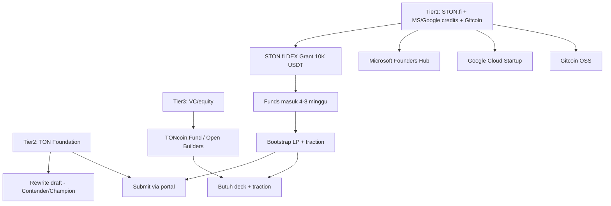

# Grants & Investor Index — Phalanx (PLX)

> **Konteks:** PLX sudah **live mainnet**, LP Ston.fi ~$34 (sangat tipis), 9 holder on-chain. Karena model grant TON 2026 menghargai traction, urutan di bawah menempatkan yang **tidak butuh traction** lebih dulu (Tier 1), lalu TON Foundation (Tier 2), lalu equity/VC (Tier 3).
>
> **Sifat automation:** hampir semua platform di bawah **tidak punya API publik** — form web / bot Telegram. Automation yang ada di repo (`scripts/plx-fundraising-automation.py`, `scripts/grants-tracker.py`) berfungsi sebagai **generasi submission pack + tracking status/deadline + alert follow-up + probe (bila ada endpoint publik)**. Submit akhir dilakukan manusia.
>
> **Tidak boleh commit:** mnemonic, `.env`, `wallets.toml`, folder investor/MONETIZATION. File ini aman disimpan di `docs/`.

---

## Tier 1 — Apply sekarang (tidak butuh traction atau traction kecil)

| # | Program | Amount | Syarat inti | Deadline | Apply | Status verifikasi |
|---|---------|--------|-------------|----------|-------|-------------------|
| 1 | **STON.fi DEX Grant** | hingga **$10K USDT** | Integrasi **SDK/widget STON.fi** ke produk (✅ sudah: `@ston-fi/api`+`@ston-fi/sdk` di `stonfi-liquidity.ts`/`stonfi-swap-sell.ts`, UI `add-liquidity-panel.tsx`, pool PLX/TON live) | **Evergreen** (tanpa batas) | https://ston.fi/grant-program | ✅ Terverifikasi 2026-08-28 (integrasi ada) |
| 2 | **Microsoft Founders Hub** | hingga ~$150K kredit Azure | Startups, tidak butuh traction besar | Rolling | https://foundershub.microsoft.com | Perlu verifikasi ulang |
| 3 | **Google Cloud Startup** | hingga ~$100K kredit GCP | Cloud-native product, GPU trial | Rolling | https://cloud.google.com/startup | Perlu verifikasi ulang |
| 4 | **Gitcoin OSS Round** | ETH matching pool | Repo open-source + `plx-token` MIT | Per round | https://gitcoin.co | Pantau round aktif |

> **Kenapa prioritas ini:** STON.fi tidak butuh metrik pengguna yang besar — cukup produk **yang mengintegrasikan SDK/widget**; PLX sudah memenuhi secara teknis. Kredit MS/GCP menurunkan biaya cloud sehingga TON bisa dialihkan ke LP. Gitcoin OSS cocok untuk 22 kontrak MIT.

---

## Tier 2 — TON Foundation (naik setelah traction)

| # | Program | Amount | Syarat inti | Deadline | Apply | Status verifikasi |
|---|---------|--------|-------------|----------|-------|-------------------|
| 5 | **TON Foundation Champion Grants** | Milestone-based (besar, utk proyek matang) | 5 vertikal: **AI, Simplified DeFi, Telegram In-App Economy, Payments, GameFi**; **Champion** (established) vs **Contender** (early-stage) | Rolling | https://ton.org/en/ton-grants | ✅ Model 2026 terverifikasi |
| 6 | **TON Society Grants & Bounties (GitHub)** | Bounty per-task | Dev tools / community tools | **PAUSED** (review struktur) | https://github.com/ton-society/grants-and-bounties | ⚠️ Paused — pantau |
| 7 | **Telegram Web3 Grants Type A/B** | hingga **$10K TON** | Type A = initial deployment; Type B = live TON project | Rolling | portal ecosystem TON | ✅ Terverifikasi |

> **Posisi PLX:** **Simplified DeFi** (primary) + **Telegram In-App Economy** (secondary) + **open-source public goods** (22 kontrak MIT). Saat LP/holder naik, upgrade dari Contender → Champion.

---

## Tier 3 — Equity / VC (butuh pitch deck + traction)

| # | Program | Amount | Syarat inti | Deadline | Apply | Status verifikasi |
|---|---------|--------|-------------|----------|-------|-------------------|
| 8 | **TONcoin.Fund** | $250M syndicate (equity/token) | TON-native, Telegram integration, token launch | Rolling | https://www.toncoin.fund/ | ✅ Tersedia (VC, bukan grant — butuh equity) |
| 9 | **Open Builders (Tonstarter)** | Incubation + fundraising | Form 4 halaman: overview, status, deck, ask | Rolling | https://forms.tonstarter.com/build | ✅ Form aktif |
| 10 | **TON Accelerator / Synergy** | $5M (cross-chain) | TON × EVM, DeFi/game/infra | Cohort-based (setengah pause 2026) | lewat TON events | ⚠️ Sebagian pause |

---

## Prioritas algoritme (berdasarkan ketergantungan)

---

## Apa yang terjadi ketika dana masuk (4–8 minggu kemudian)

1. **STON.fi** → USDT untuk development (bisa dialihkan sebagian untuk LP PLX/TON, atau bayar audit).
2. **Microsoft/Google** → kredit cloud → hemat biaya PLX86/GPU → sisakan TON untuk LP.
3. **Gitcoin OSS** → ETH matching untuk `plx-token` repo.
4. **TON Foundation** → TON untuk LP bootstrap + third-party audit (transparan, on-chain).

---

## File pendukung

- **Aplikasi STON.fi (draft + narrative):** [`STONFI-GRANT-APPLICATION.md`](STONFI-GRANT-APPLICATION.md)
- **Draft TON Foundation (rewrite 2026):** [`TON-GRANT-APPLICATION.md`](TON-GRANT-APPLICATION.md)
- **Traction bridge (prasyarat milestone grant):** [`TRACTION-BRIDGE.md`](TRACTION-BRIDGE.md)
- **Automation tracker:** `scripts/grants-tracker.py` + `scripts/plx-fundraising-automation.py`
- **Alamat on-chain (single source):** `toolkit-staging/web/lib/plx.ts` → `PLX_MAINNET_MINTER`, `PLX_MAINNET_STONFI_POOL`

---

*Dibuat: 2026-09-06. Perbarui kolom status verifikasi setiap kali submit / dapat respons.*
