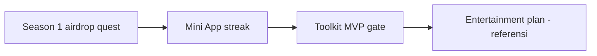

# PLX Holder Growth — airdrop & retention (konsep psikologis)

> **Status:** rencana operasi **sekarang / near-term** (2026-06-10).  
> **Bukan** janji return investasi — reward **utility & partisipasi** ekosistem.  
> **Sumber distribusi:** Community Treasury **200M PLX** (`EQD1XDv0Awjx0GUVv6YQYYnvEmjcKJ9iEBjvtHPM2nWML-q9`) + opsional Marketing **50M** untuk sprint — [`TRANSPARENCY.md`](TRANSPARENCY.md).  
> **Jangka panjang casino/game:** [`PLX-ENTERTAINMENT-AND-GAME-SUPPLY-PLAN.md`](PLX-ENTERTAINMENT-AND-GAME-SUPPLY-PLAN.md) (referensi saja).

---

## 0. Prinsip desain (anti “malas menunggu”)

| Buruk (orang bosan) | Baik (psikologi aktif) |
|---------------------|------------------------|
| “Airdrop bulan depan” | **Reward instan** ≤ 24 jam setelah aksi |
| Satu dump besar sekali | **Aliran kecil berkala** + milestone |
| Semua dapat sama | **Tier + variasi** (near-miss, mystery) |
| Hanya untuk deployer | **Jalur Holder** vs **Jalur Builder** |
| Tidak ada status | **Badge / streak / leaderboard** |
| Hold opsional | **Lock 7 hari** = multiplier (sunk cost ringan) |

**PLX sudah live** — tidak ada “TGE menunggu”. Narasi: **Formation Season** (musim), bukan “airdrop someday”.

---

## 1. Konsep kampanye: **PLX Formation Seasons**

Musim berdurasi **1–6 bulan** per periode (admin set `start_at` / `end_at`), diulang dengan tema baru. Setiap musim punya:

- **Battlepass gratis** (semua bisa ikut)
- **Cap per wallet** (anti drain + anti sybil)
- **Leaderboard publik** (sosial)
- **Snapshot holder** di akhir musim (status carry ke musim berikutnya)

### Jalur peserta (tidak semua harus deploy token)

| Jalur | Target | Contoh aksi |
|-------|--------|-------------|
| **Holder** | Orang yang mau ikut ekosistem tanpa deploy | Swap, hold, check-in, quiz, referral |
| **Builder** | Yang pakai / akan pakai toolkit | Deploy testnet, wizard draft, GitHub star |
| **Ambassador** | Top referrer | Tribe leaderboard |

---

## 2. Mekanik psikologis (map ke fitur)

| Psikologi | Mekanik kampanye | Implementasi |
|-----------|------------------|--------------|
| **Instant gratification** | First action bonus | 500–2k PLX langsung setelah verifikasi swap ≥0.05 TON |
| **Variable reward** | Mystery crate | 70% kecil / 25% medium / 5% “jackpot” visual (bukan janji profit) |
| **Loss aversion** | Streak harian | Miss 1 hari = streak reset; tampilkan “🔥 5 day streak” |
| **Sunk cost** | Soft lock | Hold ≥X PLX 7 hari → multiplier 1.5× poin musim |
| **FOMO** | Window 1–6 bulan | “Formation Season 1 ends in 48h” countdown di Mini App |
| **Sosial** | Tribe / referral | 3 teman = crate bonus; tribe top 10 = badge |
| **Progress** | XP bar ke tier | “Formation II” butuh 800 XP — selalu terlihat % |
| **Identity** | On-chain badge (opsional) | SBT “Season 1 Formation” — tidak bisa dijual |
| **Curiosity** | Cliffhanger | Akhir musim: teaser Season 2 + early slot |

---

## 3. Alur Season 1 (contoh operasi 21 hari)

### Fase 0 — Pre-launch (3 hari)

- Telegram post + countdown
- Halaman `/plx-token` → CTA “Join Formation Season 1”
- **Tidak** distribusi PLX sebelum aturan publik

### Fase 1 — Hari 1–7 (“Easy wins”)

| Task | XP | PLX (dari community) | Verifikasi |
|------|-----|----------------------|------------|
| Connect wallet di site | 50 | — | TonConnect session |
| Swap ≥0.05 TON→PLX Ston.fi | 200 | 1,000–3,000 | Tonviewer tx hash |
| Hold PLX 24h (snapshot) | 100 | — | TonAPI balance |
| Join Telegram + verify | 50 | — | TG bot deep link |
| Daily check-in (streak) | 30/hari | crate kecil | Mini App / bot |

**Cap musim per wallet:** mis. **50,000 PLX** max dari quests.

### Fase 2 — Hari 8–14 (“Depth”)

| Task | XP | Catatan |
|------|-----|---------|
| Refer 1 wallet yang swap | 300 | Anti-fraud: referrer hanya jika referee hold 48h |
| Quiz 5 soal Phalanx (utility) | 150 | Bukan price prediction |
| Post Tonviewer tx di thread | 50 | Sosial proof |
| Optional: deploy testnet jetton | 500 | Jalur Builder |

### Fase 3 — Hari 15–21 (“Finale”)

- Leaderboard freeze
- **Mystery finale crate** untuk semua yang ≥500 XP
- Top 50: bonus PLX + badge
- Publish `data/pioneer-season-1-results.json` (alamat + amount, on-chain tx list)

### Distribusi PLX

1. Batch transfer dari `plx-community` (manual script atau queue)
2. Announce di Telegram **sebelum** tx — [`TRANSPARENCY.md`](TRANSPARENCY.md)
3. Log: `data/airdrop-season-1-log.json`

**Budget Season 1 disarankan:** **2–5M PLX** total (bukan ratusan juta) — banyak wallet kecil > satu whale.

---

## 4. Retention setelah airdrop (agar tetap hold)

| Loop | Frekuensi | Tanpa deploy token |
|------|-----------|-------------------|
| **Season 2** mulai 7 hari setelah Season 1 | 14–21 hari | Carry streak bonus |
| **Holder tier** snapshot bulanan | Bulanan | Pioneer I/II/III di profil |
| **Utility reminder** | Push TG | Diskon 50% deploy toolkit dengan PLX |
| **Governance teaser** | Kuartal | Vote signaling (non-binding) |
| **LP deepening report** | Kuartal | Transparansi → trust hold |

**Jangan** kirim “sell now” / price target. **Do** kirim “your tier unlocks X utility”.

---

## 5. Anti-sybil & compliance

| Risiko | Mitigasi |
|--------|----------|
| Bot farm | TG account + wallet + min swap on-chain |
| Wash referral | Referee must hold 48h + min balance |
| Dump setelah airdrop | Cap kecil per wallet; lock multiplier incent hold |
| Scam label Tonkeeper | **Tidak** copy Tonkeeper airdrop; utility quest only |
| Legal | Teks: “Not investment advice. Utility participation rewards.” |
| Gas | Batch transfers; max N claims/day dari treasury |

---

## 6. Tech checklist (toolkit / bot)

- [ ] TG bot: `/verify` link wallet (TonConnect deep link)
- [ ] API: submit tx hash → validate Ston.fi swap via TonAPI
- [ ] DB: `pioneer_xp`, streak, season_id
- [ ] Mini App atau web page: progress bar + countdown
- [ ] Script: `scripts/airdrop-season-batch.sh` dari `plx-community`
- [ ] Public leaderboard page (wallet truncated `EQ…abc`)

Paralel dengan Mini App Fase 2 di [`POST-MVP-ECOSYSTEM-AND-FUNDING-PLAN.md`](POST-MVP-ECOSYSTEM-AND-FUNDING-PLAN.md).

---

## 7. Metric sukses (Season 1)

| Metric | Target |
|--------|--------|
| Unique wallets qualified | ≥ 200 |
| Holder count (TonAPI) | +30% dari baseline |
| D7 return check-in | ≥ 20% peserta |
| % peserta yang hold 7d post-claim | ≥ 40% |
| Builder path participants | ≥ 20 deploy testnet |

Track: [`plx-dex-dashboard.py`](../scripts/plx-dex-dashboard.py), TonAPI holders.

---

## 8. Template post Telegram (Season 1)

```
PLX Pioneer Season 1 — 21 days

PLX is LIVE on TON. No waiting for TGE.

Earn XP + small PLX rewards:
• Swap ≥0.05 TON→PLX on Ston.fi
• Daily check-in (streak = bonus)
• Refer builders & holders

Not investment advice. Utility ecosystem rewards.
Start: https://plx.foundation/plx-token

Pool: https://app.ston.fi/pools/EQAm-5HxQpfQl8_lqyvax4AEPS9LXp6rE8AFr35hcfRPyZTq
```

---

## 9. Urutan vs rencana jangka panjang



**Sekarang:** Season 1 + quest ([`TELEGRAM-QUEST-SWAPS.md`](TELEGRAM-QUEST-SWAPS.md)).  
**Nanti:** entertainment / white-label — hanya baca [`PLX-ENTERTAINMENT-AND-GAME-SUPPLY-PLAN.md`](PLX-ENTERTAINMENT-AND-GAME-SUPPLY-PLAN.md).

---

*Revisi setelah Season 1 selesai dengan hasil on-chain aktual.*
