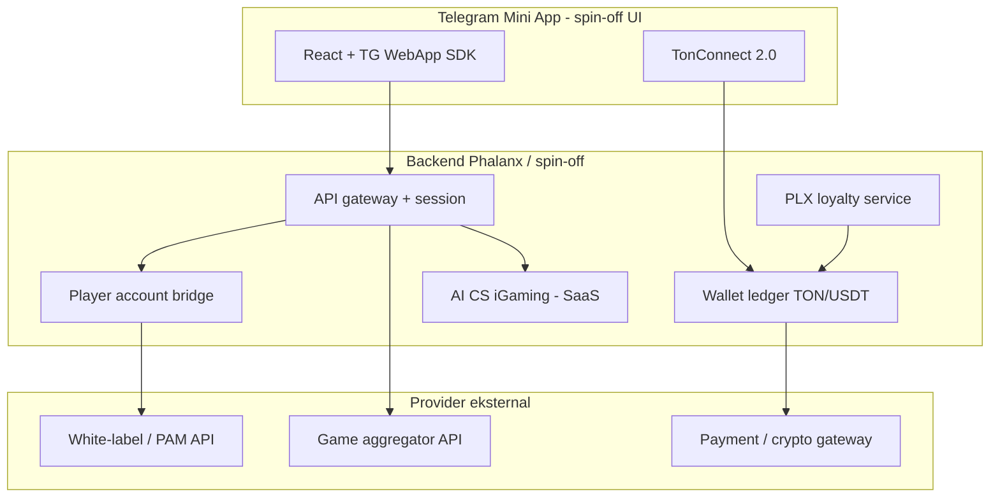
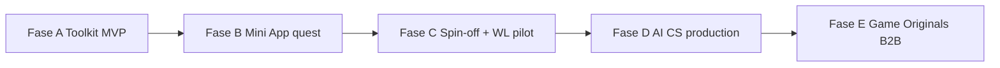

# Rencana strategis: Entertainment spin-off, AI CS iGaming, & supply game B2B

> **Status:** **REFERENSI JANGKA PANJANG** — catatan agar tahapan tidak lupa. **Tidak dieksekusi** sebelum toolkit Fase 1 gate lolos.  
> **Prinsip:** Phalanx Toolkit tetap **infra audited**; entertainment & gambling berjalan di **brand/entity terpisah**.  
> **Token:** PLX mainnet live — [`MAINNET-DEPLOYMENT-RECORD.md`](MAINNET-DEPLOYMENT-RECORD.md).  
> **Gate awal:** Toolkit happy path prod ([`POST-MVP-ECOSYSTEM-AND-FUNDING-PLAN.md`](POST-MVP-ECOSYSTEM-AND-FUNDING-PLAN.md) Fase 1).  
> **Sekarang (holder growth):** [`PLX-AIRDROP-AND-RETENTION-CAMPAIGN.md`](PLX-AIRDROP-AND-RETENTION-CAMPAIGN.md).

---

## 0. Tesis (mengapa ini selaras)

| Pilar | Fungsi | Retensi / margin |
|-------|--------|------------------|
| **Phalanx Toolkit** (`plx.foundation`) | Deploy jetton, vesting, dashboard | Utility B2B, fee deploy |
| **Entertainment operator** (spin-off) | Casino / Mini App Telegram, habit loop emosional | GGR, cashback, VIP |
| **AI Customer Service iGaming** (produk Anda) | Deposit/withdraw, KYC triage, dispute, 24/7 | SaaS per operator + menekan biaya ops |
| **Game studio B2B** (fase lanjut) | Produksi game proprietary → dijual ke operator lain | Rev share / license fee per integrasi |

**Motor psikologis** (sulit dilawan): dopamin/near-miss, loss aversion, sunk cost deposit, sosial (tribe/leaderboard), FOMO (battlepass/harian). Tujuan: **ikatan harian** ke ekosistem → PLX sebagai **loyalty & status**, bukan janji return investasi.

**Sinergi operasional:** Operator tanpa tim CS besar → AI CS menangani 80%+ tiket rutin (status deposit, withdraw pending, limit, bonus, self-exclusion). Saat Phalanx scale operator + jual game ke pihak ketiga, **satu stack ops** dipakai ulang.

---

## 1. Pemisahan brand (wajib)

| Lapisan | Brand publik | Domain contoh | Narasi |
|---------|--------------|---------------|--------|
| Infra | **Phalanx Foundation** | `plx.foundation` | Audited toolkit, open source, treasury transparan |
| Operator | **Spin-off** (nama TBD) | domain terpisah, TG bot terpisah | 18+ entertainment, lisensi jelas |
| AI CS | **Produk SaaS** (nama TBD) | subdomain / produk standalone | B2B untuk operator iGaming |
| Game B2B | **Studio label** (bisa di bawah spin-off atau Phalanx Labs) | GitHub publik untuk SDK integrasi | “Originals” untuk operator |

**Jangan** mempromosikan casino dari homepage toolkit utama. Link silang hanya setelah spin-off punya halaman legal (Terms, 18+, Responsible Gaming).

**PLX di listing publik toolkit:** tetap **utility** ([`README.md`](../README.md)). Di spin-off: PLX = loyalty tier, battlepass, cashback boost, diskon toolkit — **bukan** narasi investasi.

---

## 2. Arsitektur target (white-label + UI sendiri)

Anda **tidak** perlu membangun RNG Crash/Slots dari nol di fase awal. Yang dibangun:

| Komponen | Build sendiri | Via API/provider |
|----------|---------------|------------------|
| UI / branding Mini App | ✅ | — |
| Auth Telegram + TonConnect | ✅ | — |
| Saldo user, deposit/withdraw orchestration | ✅ (orchestrator) | Gateway crypto |
| Launch game (iframe/deep link) | ✅ wrapper | Aggregator |
| RNG, odds, 4000 slot | ❌ | Aggregator |
| KYC/AML workflow | ✅ UI + rules | Provider modul |
| CS deposit/withdraw | ✅ **AI CS produk Anda** | — |
| Lisensi iGaming | Entity spin-off | White-label license |

**Deposit utama fase awal:** TON + USDT (stabil perceived value). **PLX:** hold/stake untuk tier, reward quest, battlepass — bukan chip wager utama sampai LP ≥ gate internal (lihat §6).

---

## 3. AI Customer Service iGaming — integrasi rencana

Produk CS AI Anda = **keunggulan operasional** vs operator kecil dan **produk B2B** untuk studio lain.

### 3.1 Scope otomasi (prioritas)

| Kategori tiket | % estimasi volume | AI handle | Eskalasi manusia |
|----------------|-------------------|-----------|------------------|
| “Deposit belum masuk” | Tinggi | Cek chain + hash + status gateway | Fraud / mismatch |
| “Withdraw pending” | Tinggi | Status pipeline + SLA message | Manual review limit |
| Bonus / promo / battlepass | Sedang | Policy RAG | Dispute nilai |
| Akun / login Telegram | Sedang | Bot flow | Compromise |
| KYC / dokumen | Sedang | Pre-screen + instruksi | Reject final |
| Responsible gaming | Rendah | Self-exclusion, limit set | Crisis |
| Game dispute (“game curang”) | Rendah | Provably fair FAQ + log round | Provider ticket |

### 3.2 Integrasi teknis (checklist)

- [ ] Webhook: deposit confirmed, withdraw requested/completed (dari PAM/gateway)
- [ ] Read-only TonAPI / TonConsole: verifikasi tx on-chain untuk TON deposit
- [ ] Ticket bus: webhook ke AI CS + human queue (Intercom, Zendesk, atau internal)
- [ ] RAG policy: bonus rules, withdraw limit, negara terblokir, 18+
- [ ] Bahasa: EN + ID minimal (TG audience TON global)
- [ ] Audit log: setiap jawaban AI + escalation ID (compliance)
- [ ] **Tidak** memberikan janji payout oleh AI — hanya status + langkah berikutnya

### 3.3 Model bisnis AI CS

| Tier | Klien | Harga indikatif |
|------|-------|-----------------|
| Internal | Spin-off operator Phalanx | Biaya dev — margin GGR |
| SaaS | Operator white-label kecil | Per seat / per 1k tiket |
| Bundle | Operator + game B2B dari studio Anda | Rev share + SaaS |

**Pitch:** “Launch casino dalam 6 minggu **tanpa** tim CS 10 orang” — align dengan white-label narrative.

---

## 4. Game studio B2B (produksi sendiri → banyak operator ambil)

Referensi: **Whale Originals** (Crash, Dice, Mines, in-house, provably fair, MCP untuk agent).

### 4.1 Fase produksi

| Fase | Output | Konsumen |
|------|--------|----------|
| **G0** | 1 mini-game sederhana (wheel quest, non-wager) di Mini App Phalanx | Growth PLX |
| **G1** | 2–3 **Originals** provably fair (Mines, Limbo, Dice) | Spin-off operator |
| **G2** | SDK integrasi: launch URL + wallet API + RTP config | Operator B2B |
| **G3** | Katalog 6+ titles + certification narrative | Aggregator-style sales |

### 4.2 Stack teknis disarankan

| Lapisan | Opsi |
|---------|------|
| Client Mini App | React + Phaser / Pixi (TON docs: Flappy Bird pattern) |
| Fairness | Server seed + client seed hash (provably fair standard) |
| Backend | Node/Nest (selaras Whale stack) atau extend Railway API toolkit |
| On-chain opsional | Jetton untuk shop/cosmetic — tidak wajib untuk RNG casino |
| Distribusi | iframe + signed session token ke operator partner |

### 4.3 Monetisasi B2B game

- **Rev share GGR** per game (industri: 5–15% dari operator)
- **Setup fee** integrasi white-label
- **PLX hook:** operator partner dapat diskon license jika hold PLX / stake di treasury program (opsional, fase G3)

**Mengapa banyak operator akan ambil:** mereka butuh **differentiation** (Whale Originals), tidak mau build RNG + compliance sendiri; Anda supply **game + ops AI CS** = paket lengkap.

---

## 5. PLX sebagai loyalty rail (bukan chip utama dini)

| Mekanik | Psikologi | On-chain / off-chain |
|---------|-----------|---------------------|
| Battlepass harian | FOMO | Off-chain poin → redeem PLX/utility |
| Tribe / referral | Sosial | Referral contract atau DB |
| Cashback tier | Sunk cost | Hold snapshot PLX |
| Wheel quest (non-wager) | Dopamin | Mini App |
| Diskon toolkit | Bridge builder↔player | Payment splitter existing |
| Stake untuk VIP withdraw priority | Status | Optional lock contract |

### Gate internal — PLX sebagai wager currency

| Gate | Threshold | Alasan |
|------|-----------|--------|
| LP pool PLX/TON | ≥ **$5,000** likuiditas | Volatilitas chip |
| Holder | ≥ **500** (TonAPI) | Distribusi |
| Listing | Dyor + (DexScreener atau CG) | Harga referensi |
| Legal | Spin-off entity + lisensi aktif | Compliance |

Sampai gate terpenuhi: **USDT/TON wager**, PLX **reward & status**.

---

## 6. Roadmap fase (urutan eksekusi)

### Fase A — Toolkit beres (BLOCKER, sekarang)

Gate: [`POST-MVP-ECOSYSTEM-AND-FUNDING-PLAN.md`](POST-MVP-ECOSYSTEM-AND-FUNDING-PLAN.md) Fase 1.

- [ ] `/build` happy path prod
- [ ] Mini App scaffold + TonConnect
- [ ] LP dashboard / top-up jalur

**Tidak mulai** spin-off casino sebelum minimal satu gate layanan toolkit tercentang.

### Fase B — Mini App habit (3–6 bulan setelah A)

- Quest: swap PLX, check-in, referral ([`TELEGRAM-QUEST-SWAPS.md`](TELEGRAM-QUEST-SWAPS.md))
- Wheel / streak **tanpa** real-money wager (regulasi lebih ringan)
- Metric retention: D1, D7, D30 (lihat §8)
- Listing: tApps ([`TAPPS-TON-FOUNDATION.md`](TAPPS-TON-FOUNDATION.md))

### Fase C — Spin-off operator pilot (6–12 bulan)

- Entity + lisensi (Anjouan / Curacao / white-label under provider license — konsultasi legal)
- Pilih **1** white-label provider → sandbox → 2–3 game live
- Deposit TON/USDT; PLX loyalty only
- AI CS: mode internal untuk spin-off

Deliverable: operator live dengan <5 human CS untuk rutin.

### Fase D — AI CS SaaS (parallel setelah C stabil)

- Produk multi-tenant untuk operator eksternal
- Case study: spin-off Phalanx sebagai klien pertama
- Sales: TG casino communities, white-label conferences

### Fase E — Game B2B (12–24 bulan)

- G1 Originals di spin-off
- Dokumentasi integrasi + 1 operator pilot eksternal
- Pitch Animoca / TON gaming grant ([`FUNDRAISING-AND-LP-OPTIONS.md`](FUNDRAISING-AND-LP-OPTIONS.md))

---

## 7. Daftar penyedia — gratis vs hubung API saja (referensi)

> **Jujur operasional:** white-label **real-money casino 100% gratis** praktis **tidak ada** — ada biaya bulanan, rev share GGR, atau Anda host backend sendiri. Yang **gratis** biasanya: **open source**, **play-money demo**, atau **affiliate link** (tanpa integrasi game).

### 7.1 Kategori A — Gratis (open source / self-host, modal ≈ UI + hosting)

Cocok **prototipe & Fase B** (play money / quest). Anda bangun UI; RNG & logic dari repo.

| Nama | URL | Isi | Lisensi |
|------|-----|-----|---------|
| **Open Stake Clone** | https://github.com/tanh1c/stake-originals-clone | Crash, Plinko, Mines, Dino — React + provably fair | Cek repo |
| **provably-fair-framework** | https://github.com/matthewlilley/provably-fair-framework | Crash, Dice, Roulette (TS library) | Cek repo |
| **provable-core** | https://github.com/provableio/provable-core | RNG HMAC-SHA256 (@provableio) | MIT |
| **provably-fair-rng** | https://github.com/dinethlive/provably-fair-rng | REST API Hono + verifier UI; **demo API key** di README | Cek repo |
| **lucky-slots-v3** | https://github.com/highnet/lucky-slots-v3 | Slot engine + GraphQL API (self-host) | Cek repo |
| **TON Flappy Bird GameFi** | https://github.com/ton-community/flappy-bird | Pola jetton + shop TON docs | Edukasi TON |

**Yang tetap Anda bangun:** saldo demo, session user, Telegram shell — **tidak** perlu bayar provider.

### 7.2 Kategori B — API game aggregator (hubung saja, **bukan gratis**)

Satu integrasi → ribuan title. Bayar **rev share % GGR** atau fee minimum. Butuh **PAM/wallet** (sendiri atau white-label).

| Provider | URL | Model | Catatan |
|----------|-----|-------|---------|
| **SoftSwiss** | https://www.softswiss.com | Aggregator B2B | Tier enterprise |
| **Slotegrator** | https://slotegrator.com | Game API + aggregator | 10k+ games, kontrak B2B |
| **EveryMatrix** | https://everymatrix.com | Platform + games | Turnkey / modular |
| **Relax Gaming** | https://www.relax-gaming.com | Aggregator API | Game only |
| **BGaming** | https://bgaming.com | Studio + B2B API | Crypto-friendly |
| **Pragmatic Play** | https://www.pragmaticplay.com | Studio API | Butuh lisensi operator |
| **NEWBOSS API** | https://idrnewboss999.com | 12k+ game API/H5 | Klaim SaaS; **~$999** entry (bukan gratis) |

### 7.3 Kategori C — White-label platform (brand Anda, mereka backend)

| Provider | URL | Biaya indikatif | “Hanya UI”? |
|----------|-----|-----------------|-------------|
| **Integrated Gaming Labs** | https://iglabs.dev | API-only ~€4.8k/bulan | **API-only tier** = UI Anda + wallet mereka |
| **Blitz365** | https://www.blitz365.pro | ~$800/bulan + deploy | Platform jadi; skin logo |
| **1638.cloud** | https://1638.cloud | Negosiasi | Turnkey crypto casino |
| **Tecpinion** | https://www.tecpinion.com | GGR share | WL 3–6 minggu |
| **Digient** | https://www.digient.co | Setup + GGR | WL turnkey |
| **GammaPlus** | https://www.gammaplus.io | Turnkey fee | Sportsbook + crypto |
| **NEWBOSS** | https://idrnewboss999.com | ~$999 SaaS | All-in-one cepat |

### 7.4 Kategori D — Gratis integrasi = **affiliate / referral** (tanpa game API)

| Provider | URL | Biaya | Catatan |
|----------|-----|-------|---------|
| **1638.cloud Partnership** | https://1638.cloud | $0 integrasi | ~10% referral closed deal |
| **Ston.fi pool** | https://app.ston.fi | $0 | Link pool PLX — bukan casino |
| **Operator afiliasi** (Whale, dll.) | Program afiliasi operator | $0 | Cek terms; tidak bind ekosistem PLX |

### 7.5 TON / Telegram (quest & T2E, bukan full casino)

| Provider | URL | Biaya | Fase |
|----------|-----|-------|------|
| **Funton.ai** | https://www.funton.ai | GameFi-as-a-Service — **hubungi sales** | T2E Mini App |
| **Ment Tech** | https://www.ment.tech | Project fee | Custom TMA |
| **Blocsys** | https://blocsys.com | Project fee | TMA + TON |
| **TechChain** | https://www.techchain.solutions | Project fee | Wager mini-app case study |

### 7.6 Matriks “modal UI saja” — realita

| Target | Gratis? | Yang Anda kerjakan |
|--------|---------|-------------------|
| Demo Crash/Mines di Mini App | ✅ (Kategori A) | UI + host open source |
| Real-money casino | ❌ | WL + lisensi + wallet + CS (AI CS Anda) |
| Ribuan slot via API | ❌ (rev share) | Integrasi API + PAM |
| Link afiliasi ke casino lain | ✅ | Landing saja |
| Quest / wheel **tanpa wager** | ✅ | Mini App Phalanx — lihat airdrop doc |

**RFP checklist** (saat Fase C, kirim ke 3 vendor Kategori B/C):

1. REST/OpenAPI untuk: register, balance, deposit webhook, withdraw, game launch URL
2. Crypto: TON, USDT (TRC20/TON jetton), BTC optional
3. Telegram Mini App / WebView support
4. Lisensi: operate under provider vs own license
5. GGR / setup fee / minimum bankroll
6. Sandbox + SLA withdraw
7. Responsible gaming: limit, self-exclusion API

---

## 8. Metric retention & bisnis

### 8.1 Retention (Mini App / operator)

| Metric | Target pilot | Target scale |
|--------|--------------|--------------|
| **D1 retention** | ≥ 25% | ≥ 35% |
| **D7 retention** | ≥ 12% | ≥ 18% |
| **D30 retention** | ≥ 5% | ≥ 10% |
| Session / user / day | ≥ 1.5 | ≥ 2.5 |
| Deposit conversion (register→dep) | ≥ 8% | ≥ 15% |

### 8.2 Ekosistem PLX

| Metric | Catatan |
|--------|---------|
| Holder count | TonAPI; naik dengan quest + loyalty |
| PLX in loyalty lock | Off-chain snapshot atau stake contract |
| Toolkit deploy dari spin-off users | Bridge metric |
| Unique swap wallets / week | [`plx-dex-dashboard.py`](../scripts/plx-dex-dashboard.py) |

### 8.3 AI CS

| Metric | Target |
|--------|--------|
| Auto-resolve rate | ≥ 70% tiket tier-1 |
| CS cost per active player | < $0.50/mo pada scale |
| Withdraw SLA compliance | ≥ 95% dalam policy window |
| Escalation accuracy | Human approve ≥ 90% AI suggestion |

### 8.4 Game B2B

| Metric | Target G2 |
|--------|-----------|
| Operator integrasi live | ≥ 3 |
| GGR share dari third-party | Track per title |
| Integration time | < 2 minggu per operator |

---

## 9. Legal & compliance checklist

- [ ] **Entity** spin-off (bukan Phalanx Foundation nonprofit narrative campur aduk)
- [ ] **Lisensi iGaming** atau sub-license white-label
- [ ] **18+** gate di Mini App + Terms
- [ ] **Geo block** (negara terlarang)
- [ ] **KYC/AML** policy — trigger amount-based
- [ ] **Responsible gaming:** deposit limit, cooldown, self-exclusion
- [ ] **Privacy** — data TG + wallet terpisah dari toolkit user DB jika bisa
- [ ] **PLX marketing** — tidak janji profit; utility + entertainment terpisah
- [ ] **Tonkeeper / listing** — gambling brand terpisah mengurangi risiko label SCAM di jetton infra
- [ ] Konsultasi **legal lokal** (Indonesia: hati-hati promosi gambling)

> Bukan nasihat hukum — wajib review counsel sebelum go-live real money.

---

## 10. Pendanaan & grant (angle pitch)

| Sumber | Angle pitch |
|--------|-------------|
| **TON Foundation** | TON-native Mini App + game Originals + open SDK |
| **Animoca** | Toolkit + entertainment + game supply |
| **Microsoft / Google AI grant** | AI CS iGaming (hemat cloud inference) |
| **GGR spin-off** | Reinvest ke LP PLX + game dev |
| **Toolkit revenue** | 25% sweep ke LP ([`TREASURY-SWEEP.md`](TREASURY-SWEEP.md)) |

Deck **dua slide terpisah:** (1) Phalanx infra, (2) entertainment stack — investor grant gaming pilih slide 2; developer grant pilih slide 1.

---

## 11. Risiko utama

| Risiko | Mitigasi |
|--------|----------|
| Brand toolkit terkontaminasi | Pemisahan domain + entity |
| LP PLX tipis + volatilitas | USDT/TON wager dini |
| Kompetisi Whale / besar | Diferensiasi: AI CS + game B2B + builder bridge |
| Biaya white-label + legal | Pilot kecil; SaaS CS offset ops |
| Regulasi / akun diblokir | Lisensi + geo block |
| Ketergantungan provider | G1 Originals mengurangi aggregator lock-in |
| Etika / addiction | RG tools wajib — juga mitigasi legal |

---

## 12. Dependensi repo & dokumen

| Area | Path / doc |
|------|------------|
| Toolkit gate | `toolkit-staging/docs/IMPLEMENTATION-PLAN.md` |
| Mini App Fase 2 | [`POST-MVP-ECOSYSTEM-AND-FUNDING-PLAN.md`](POST-MVP-ECOSYSTEM-AND-FUNDING-PLAN.md) §2.2 |
| LP / treasury | [`TREASURY-SWEEP.md`](TREASURY-SWEEP.md), [`FUNDRAISING-AND-LP-OPTIONS.md`](FUNDRAISING-AND-LP-OPTIONS.md) |
| Listing matrix | [`TOKEN-LISTING-INDEX-MATRIX.md`](TOKEN-LISTING-INDEX-MATRIX.md) |
| Quest growth | [`TELEGRAM-QUEST-SWAPS.md`](TELEGRAM-QUEST-SWAPS.md) |
| Transparansi | [`TRANSPARENCY.md`](TRANSPARENCY.md) (jika ada) |

---

## 13. Next actions (30 hari setelah toolkit gate)

1. Nama spin-off + domain placeholder (tanpa launch publik).
2. RFP ke 3 white-label vendor (template §7).
3. Spesifikasi MVP AI CS: webhook deposit/withdraw + RAG policy v1.
4. Wireframe Mini App Fase B (quest + wheel non-wager).
5. Konsultasi legal 1 jam: lisensi path tercepat untuk TON + TG.
6. Update internal: metric dashboard D1/D7/D30 di analytics toolkit.

---

*Dokumen ini strategi internal operasi Phalanx. Revisi setelah RFP vendor & counsel review.*
