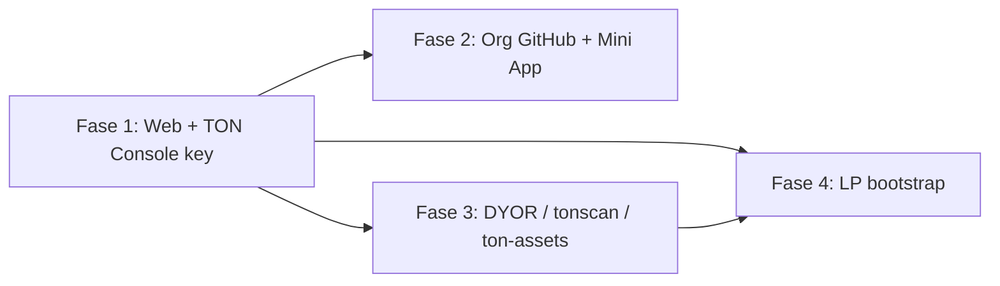

# Rencana pasca-MVP: Web → Ekosistem TON → Likuiditas & pendanaan

> **Status:** draft operasional (2026-06-02).  
> **Prinsip:** tidak ada layanan yang dianggap “beres” sampai lolos gate di [`toolkit-staging/docs/IMPLEMENTATION-PLAN.md`](../toolkit-staging/docs/IMPLEMENTATION-PLAN.md) / smoke prod.  
> **Token mainnet:** sudah live; **produk & LP** belum.

---

## 0. Jawaban singkat pertanyaan terbaru

| Pertanyaan | Jawaban |
|------------|---------|
| Sudah ada **TON Console**? | **Belum** terdaftar di repo/env. Perlu dibuat di https://tonconsole.com (login Telegram), project + **TonAPI API key**. |
| TON Console mempercepat pengindeksan? | Membantu **dApp Anda** (rate limit, webhook, analytics SQL) — **bukan** pengganti merge PR **ton-assets** untuk label SCAM Tonkeeper. |
| Jejak nama pribadi di GitHub? | PR [#5468](https://github.com/tonkeeper/ton-assets/pull/5468) saat ini dari fork akun pribadi. **Ke depan:** semua submission dari org **`phalanx-foundation`**. |
| Mini App Telegram? | Direncanakan **Fase 2** (setelah web inti stabil) + listing **tApps** / tonscan apps. |
| Dana untuk LP tanpa pemasukan bulanan? | Lihat **Bagian 4** + [`FUNDRAISING-AND-LP-OPTIONS.md`](FUNDRAISING-AND-LP-OPTIONS.md) (launchpad, grants, VC, AI credits, crowdfunding). |

---

## Fase 1 — Perbaiki web & layanan inti (BLOCKER, sekarang)

**Tujuan:** minimal satu jalur layanan **end-to-end beres** (daftar → bayar/deploy → konfirmasi on-chain atau dashboard).

### Gate “layanan beres” (contoh)

- [ ] Auth (Google/GitHub) production-ready — [`docs/OAUTH-SETUP-GUIDE.md`](OAUTH-SETUP-GUIDE.md)
- [ ] `/build` wizard: draft → pembayaran (TON/PLX/PayPal sesuai katalog) → deploy/emulasi
- [ ] API Railway + env prod selaras [`toolkit-staging/docs/MAINNET-ENV-CLOUDFLARE.md`](../toolkit-staging/docs/MAINNET-ENV-CLOUDFLARE.md)
- [ ] Smoke: landing, pricing, `/plx-token`, dashboard user
- [ ] Satu runbook “happy path” terdokumentasi di `ROUTES.md`

**Tidak mulai** promosi DYOR berbayar, tApps, atau LP besar sebelum gate di atas **minimal satu** tercentang.

### TON Console (setup di Fase 1, pararel)

1. Buka https://tonconsole.com → Connect (Telegram).
2. Buat **project** atas nama **Phalanx Foundation** (bukan nama pribadi di display name jika bisa dihindari).
3. Generate **TonAPI key** → simpan di `.env` (gitignored): `TONAPI_KEY=` / di Railway & Cloudflare Pages untuk toolkit.
4. Manfaat langsung untuk produk:
   - Rate limit lebih tinggi untuk `/api/plx-stats`, jetton balances, payment verify
   - Opsional: webhook transfer, Tonkeeper Messages (nanti, dengan Mini App)
5. **Tidak** mengharapkan TonConsole menghapus `verification: blacklist` — itu tetap lewat **ton-assets merge**.

---

## Fase 2 — Identitas publik & GitHub org (setelah web stabil)

### 2.1 GitHub — kurangi jejak nama pribadi

| Tindakan | Detail |
|----------|--------|
| PR Tonkeeper yang ada | #5468 tetap di history akun pengaju; **tidak perlu dihapus**. Isi PR mengarah ke `phalanx-foundation/plx-token`. |
| PR berikutnya | Fork & PR **hanya** dari akun/org **`phalanx-foundation`** (butuh member + PAT/machine user org). |
| Commit author | `Phalanx Foundation <ops@phalanx.foundation>` — sudah dipakai di commit ton-assets. |
| Opsional | Tambahkan `phalanx-foundation` sebagai collaborator reviewer di PR #5468 (komentar resmi org). |

### 2.2 Telegram Mini App + bot

| Item | Jalur |
|------|--------|
| Bot / webhook | `toolkit-staging/bot/` (scaffold ada) |
| Mini App | Integrasi TonConnect + deploy URL `plx.foundation` (atau subdomain `app.`) |
| **tApps Center** | https://ton.org/dev/opportunities/tapps-listing |
| **tonscan.org/apps** | Submit via https://t.me/SubmitAppBot (produk publik, bukan repo private toolkit) |

---

## Fase 3 — Ekosistem discoverability (setelah Fase 1 gate ≥1 layanan beres)

Urutan disarankan (paralel ringan diperbolehkan):

| # | Platform | Tujuan | Tautan / status |
|---|----------|--------|-----------------|
| 1 | **Tonkeeper ton-assets** | Hilangkan label SCAM di wallet | PR [#5468](https://github.com/tonkeeper/ton-assets/pull/5468) — OPEN, tunggu merge |
| 2 | **Tonscan labels** | Label alamat Treasury/LP di explorer | https://tonscan.org/labels |
| 3 | **DYOR.io** | Kartu token + visibilitas | https://dyor.io/requests → *Update token info* + *Verification*; promo opsional |
| 4 | **Ston.fi LP** | Beli/jual PLX publik | Butuh TON + PLX dari wallet LP — lihat Fase 4 |
| 5 | **tApps + tonscan apps** | Discoverability Mini App | Setelah Mini App siap demo |
| 6 | **MyTonWallet / Tonviewer** | Opsional | `TRANSPARENCY.md` |

Detail submission jetton: [`TONKEEPER-ASSET-SUBMISSION.md`](TONKEEPER-ASSET-SUBMISSION.md), appeal SCAM: [`TONKEEPER-SCAM-LABEL-APPEAL.md`](TONKEEPER-SCAM-LABEL-APPEAL.md).

---

## Fase 4 — Pendanaan likuiditas (LP) tanpa pemasukan bulanan

> Bukan nasihat keuangan; daftar opsi operasional yang umum di proyek infrastruktur token.

### 4.1 Realita

- **400M PLX** sudah di wallet LP on-chain, tetapi **bukan uang tunai** — untuk DEX Anda tetap perlu **TON** (±50–200+ TON untuk LP awal yang wajar, tergantung kedalaman).
- Tanpa volume trading, **fee LP ≈ $0**. LP adalah **fasilitas beli/jual**, bukan gaji bulanan jangka pendek.

### 4.2 Urutan sumber dana (disarankan)

| Prioritas | Sumber | Keterangan |
|-----------|--------|------------|
| **A** | **Pendapatan Toolkit** | Setelah web beres: biaya deploy/wizard (TON/PLX/PayPal) → alokasikan % ke “LP bootstrap TON”. Satu-satunya yang Anda kendalikan tanpa menjual narasi investasi kosong. |
| **B** | **Mitra / advisor** | Tawarkan LP TON side; Anda supply PLX side (sudah ada). Transparan di `TRANSPARENCY.md`. |
| **C** | **LP minimal** | Seed kecil (mis. 1–5M PLX + 10–30 TON) hanya untuk **proof of market** — bukan target utama monetisasi. |
| **D** | **Hibah / program TON** | Pantau TON Foundation, hackathon, ecosystem grants (butuh produk/demo hidup — Fase 1). |
| **E** | **Marketing wallet (50M PLX)** | Jangan dump ke market; gunakan untuk **barter** listing/promo setelah produk hidup, bukan untuk hidup sehari-hari pribadi. |
| **F** | **Presale DYOR / private round** | Hanya jika legal/compliance OK; biaya & komisi ada; **risiko reputasi** tinggi jika produk belum jalan. |

### 4.3 Yang tidak disarankan

- Menjual PLX treasury besar-besaran ke pasar tanpa LP → harga runtuh + kepercayaan hilang.
- Menggandakan token / mint tambahan (admin masih ada, tetapi merusak narasi 1B fixed).
- Membayar “fast verify Tonkeeper” ke pihak ketiga — **penipuan** (verifikasi gratis via PR resmi saja).

### 4.4 Target minimum agar “bisa dibeli”

1. Pool **PLX/TON** di Ston.fi (atau DeDust).  
2. Tonkeeper merge #5468 (agar tidak SCAM).  
3. Halaman `plx.foundation/plx-token` dengan link swap + minter.

Checklist deploy: [`MAINNET-CHECKLIST.md`](MAINNET-CHECKLIST.md) bagian Liquidity.

---

## Fase 5 — Metrik “ada yang melirik” (setelah Fase 1)

| Metrik | Alat |
|--------|------|
| Traffic situs | Cloudflare Analytics (`plx.foundation`) |
| Holder count | TonAPI / Tonviewer (naik dari 5 setelah ada transfer retail) |
| Transaksi minter | Tonviewer |
| Wizard/deploy | Log Railway + DB toolkit |
| DYOR | Setelah listing |

---

## Ringkasan timeline

---

## Tindakan Anda minggu ini (prioritas)

1. **TON Console:** daftar project + API key → masukkan ke env prod toolkit.  
2. **Web:** pilih **satu** layanan untuk diselesaikan dulu (disarankan: auth + `/build` happy path).  
3. **GitHub org:** siapkan akun machine / member org untuk PR berikutnya dari `phalanx-foundation`.  
4. **LP:** tunda sampai ada **TON** dari toolkit revenue atau mitra; jangan pakai dana pribadi terakhir tanpa buffer hidup.  
5. **Tonkeeper:** pantau PR #5468; balas jika ada komentar maintainer.

---

*Dokumen ini melengkapi `MAINNET-CHECKLIST.md` dan `tmp/PLAN-INDEX-2026-05-22.md` — tidak menggantikan IMPLEMENTATION-PLAN toolkit.*
