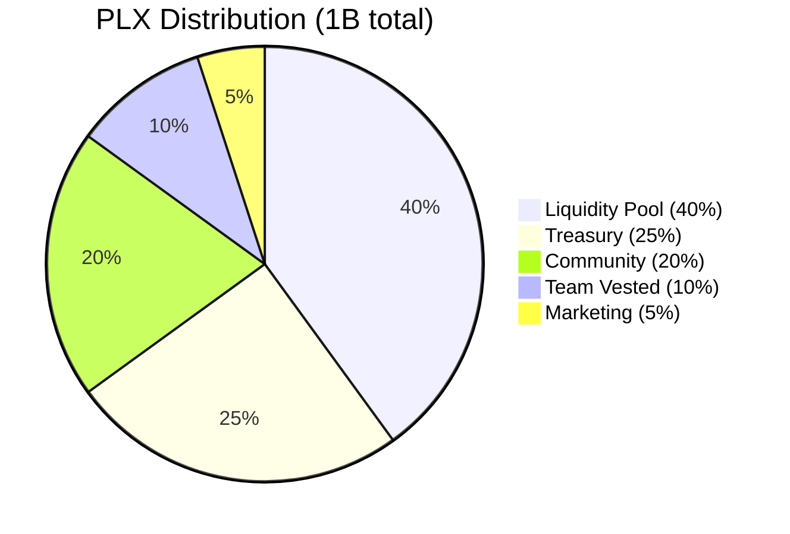
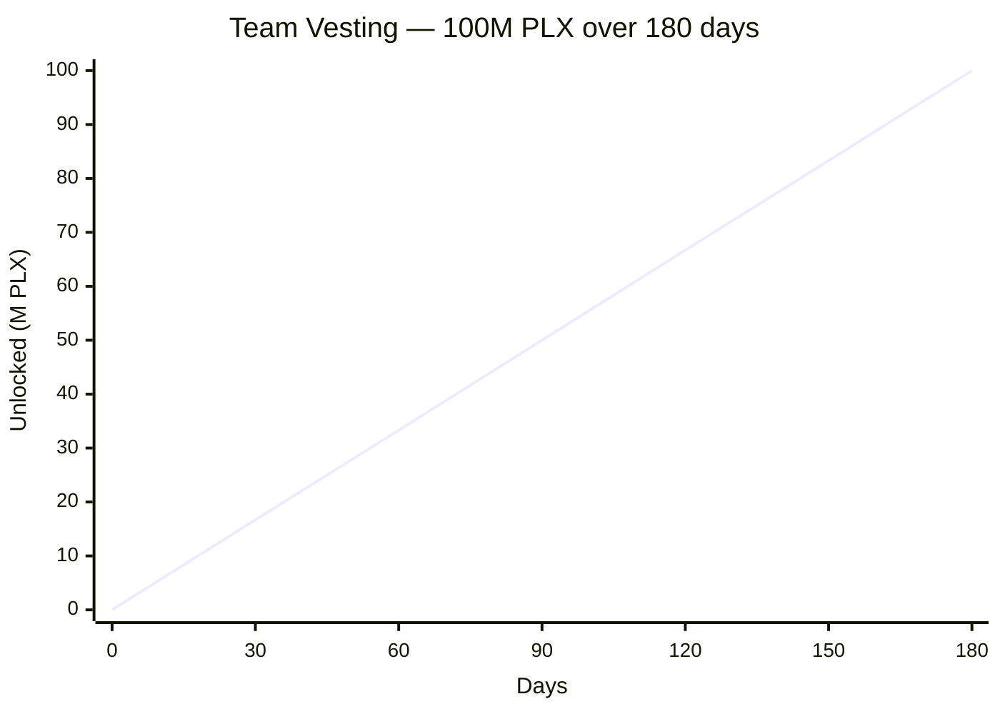

# Tokenomics — Phalanx (PLX)

## Token Specification

| Field | Value |
|---|---|
| Name | Phalanx |
| Symbol | PLX |
| Decimals | 9 (1 PLX = 1,000,000,000 nano-PLX) |
| Total Supply | 1,000,000,000 PLX (fixed; admin can renounce mint after launch) |
| Standard | TEP-74 Jetton + TEP-89 metadata |
| Workchain | 0 (basechain) |
| Built with | [Acton](https://ton-blockchain.github.io/acton/) + [Tolk](https://docs.ton.org/develop/tolk) |

## Distribution

| % | Amount | Allocation | Wallet (testnet) | Status |
|---:|---:|---|---|---|
| 40% | 400,000,000 PLX | **Liquidity Provision** | `kQD4-ER4sDGmw4PcPPJ-AwLYG9TORvZ5sJ-xNKthunKz0AOP` | Reserved for DEX (Ston.fi / DeDust) |
| 25% | 250,000,000 PLX | **Treasury** | `kQCAfIuFFlS8RJyYQU7pFaN1XqcO8V4lZl-SH8Ca950XqGal` | Operational, buyback & burn |
| 20% | 200,000,000 PLX | **Community Rewards** | `kQAZWyvZBkUctnlbqP8EVTzh43g7JcYod9NqYjenRbf2nPiC` | Airdrops, contests, partner programs |
| 10% | 100,000,000 PLX | **Team** | `kQDNPoiPbKXwjt4i9SqtBmvbUlMgWz1jCR7M5Uwjj5fI8t1l` (vesting contract) | **Locked 6 months linear** — see vesting contract |
| 5% | 50,000,000 PLX | **Marketing & Partnerships** | `kQD51illBEG2sQ5do-28UoVDyiQbyRMVagzfwnWV7QCginMA` | Listing, marketing campaigns |

> **Mainnet addresses** will be published here after mainnet deploy. The vesting contract address is deterministic from its initial config + bytecode, so you can verify ahead of time.

## Vesting Schedule (Team Allocation)

The 100M team allocation is held by an on-chain `TeamVesting` contract that releases linearly over **6 months (180 days)**.

- **Start**: deployment timestamp (recorded on-chain in vesting contract)
- **Duration**: 15,552,000 seconds (180 days, ~6 months)
- **Curve**: linear (vested = total × elapsed / duration)
- **Anyone can call `claim`** (gas paid by caller); the vesting contract sends unlocked tokens directly to the beneficiary wallet
- **Revoke**: only admin (deployer) can revoke; vested portion still goes to beneficiary, unvested goes back to admin

### Vesting Contract Get Methods

| Method | Returns |
|---|---|
| `get_vesting_data()` | Full config (beneficiary, totalAmount, startTime, duration, etc.) |
| `get_vested_amount()` | Amount unlocked at current time |
| `get_claimable_amount()` | Vested − already claimed |
| `get_claimed_amount()` | Total already claimed |
| `get_jetton_wallet_address()` | The vesting contract's PLX wallet (where the 100M is stored) |

## Token Mechanics

### Mintable
- Admin can mint new tokens (no hard cap on the contract; **soft cap is 1B per tokenomics**)
- After full distribution, admin will **drop admin** (`DropMinterAdmin` opcode `0x7431f221`) → minting permanently disabled
- Trust signal: post-renounce, supply is fully fixed

### Burnable
- Any holder can burn their own PLX (decreases `totalSupply` permanently)
- Used for **buyback & burn** mechanism: treasury periodically buys PLX from market and burns

### Transferable Owner
- Two-step admin handover: `ChangeMinterAdmin` (proposes new admin) → `ClaimMinterAdmin` (new admin claims)
- Defends against accidental transfer to wrong address
- Useful for transitioning to multisig or DAO governance

## Treasury Policy (proposed)

The 250M treasury is reserved for:

1. **Liquidity bootstrapping** — pair PLX/TON on DEX, kept as long-term LP
2. **Buyback & burn** — every quarter, treasury allocates 5–10% of accumulated TON revenue to buy and burn PLX
3. **Strategic partnerships** — grants to projects integrating PLX
4. **Operational runway** — Phalanx Foundation ecosystem development

The treasury wallet address is **publicly documented** above. All movements are visible on-chain.

## Long-term Vision

Phalanx Foundation is building a developer-tools and on-chain products ecosystem where PLX serves as:

- Payment token for premium tools (private library, plugin marketplace)
- Governance signal once DAO module is added
- Loyalty and reward currency for the community

## Contract Addresses (testnet, live)

| Contract | Address | Explorer |
|---|---|---|
| **Jetton Minter** | `kQAslxaUshiiqy5FrTbYHbBpjBgmcyTHB8vKKCemFKp508xV` | [Tonviewer](https://testnet.tonviewer.com/kQAslxaUshiiqy5FrTbYHbBpjBgmcyTHB8vKKCemFKp508xV) |
| **Team Vesting** | `kQDNPoiPbKXwjt4i9SqtBmvbUlMgWz1jCR7M5Uwjj5fI8t1l` | [Tonviewer](https://testnet.tonviewer.com/kQDNPoiPbKXwjt4i9SqtBmvbUlMgWz1jCR7M5Uwjj5fI8t1l) |

To import PLX into Tonkeeper / Tonhub on testnet, use the minter address above.
