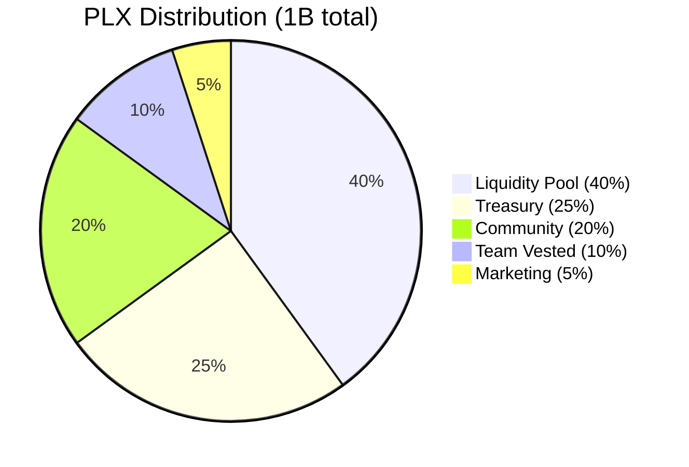
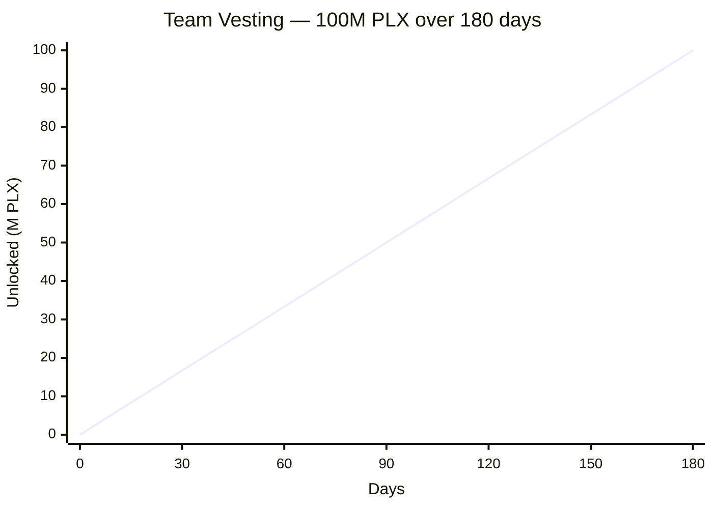
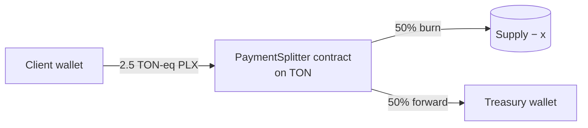

# Tokenomics — Phalanx (PLX)

## Token Specification

| Field | Value |
|---|---|
| Name | Phalanx |
| Symbol | PLX |
| Decimals | 9 (1 PLX = 1,000,000,000 nano-PLX) |
| Total Supply | 1,000,000,000 PLX (fixed; admin can renounce mint after launch) |
| Standard | TEP-74 Jetton + TEP-89 metadata |
| Workchain | 0 (basechain) |
| Built with | [Acton](https://ton-blockchain.github.io/acton/) + [Tolk](https://docs.ton.org/develop/tolk) |

## Distribution

| % | Amount | Allocation | Mainnet (UQ / EQ) | Testnet | Status |
|---:|---:|---|---|---|---|
| 40% | 400,000,000 PLX | **Liquidity Provision** | `EQAiQ41f7R5qzKsoimbujtYdy0bRKW_7Fb0rV5Z4Lw6gr3zH` | `kQD4-ER4sDGmw4PcPPJ-AwLYG9TORvZ5sJ-xNKthunKz0AOP` | Reserved for DEX (Ston.fi / DeDust) |
| 25% | 250,000,000 PLX | **Treasury** | `EQBBlAF4yz12NbrbKXYfGA1OsZzWFpkRj-TU6ciuYjBjK1aX` | `kQCAfIuFFlS8RJyYQU7pFaN1XqcO8V4lZl-SH8Ca950XqGal` | Operational, buyback & burn |
| 20% | 200,000,000 PLX | **Community Rewards** | `EQD1XDv0Awjx0GUVv6YQYYnvEmjcKJ9iEBjvtHPM2nWML-q9` | `kQAZWyvZBkUctnlbqP8EVTzh43g7JcYod9NqYjenRbf2nPiC` | Airdrops, contests, partner programs |
| 10% | 100,000,000 PLX | **Team** | `EQCs-Y2wb83zqjCpRUMiZoKLUqhI3qd6tWWm4ycZBp6lsD5l` (vesting) | `kQDNPoiPbKXwjt4i9SqtBmvbUlMgWz1jCR7M5Uwjj5fI8t1l` | **Locked 6 months linear** |
| 5% | 50,000,000 PLX | **Marketing** | `EQDB9yVhkPvEhMFo90fqHWzqYj2mESAlwObMbA6LX7fETtN6` | `kQD51illBEG2sQ5do-28UoVDyiQbyRMVagzfwnWV7QCginMA` | Listing, marketing campaigns |

> **Address formats:** Tonkeeper shows **UQ** (non-bounceable); docs/CLI often use **EQ** (bounceable) — same wallet. See [`MAINNET-DEPLOYMENT-RECORD.md`](MAINNET-DEPLOYMENT-RECORD.md).

## Vesting Schedule (Team Allocation)

The 100M team allocation is held by an on-chain `TeamVesting` contract that releases linearly over **6 months (180 days)**.

- **Start**: deployment timestamp (recorded on-chain in vesting contract)
- **Duration**: 15,552,000 seconds (180 days, ~6 months)
- **Curve**: linear (vested = total × elapsed / duration)
- **Anyone can call `claim`** (gas paid by caller); the vesting contract sends unlocked tokens directly to the beneficiary wallet
- **Revoke**: only admin (deployer) can revoke; vested portion still goes to beneficiary, unvested goes back to admin

### Vesting Contract Get Methods

| Method | Returns |
|---|---|
| `get_vesting_data()` | Full config (beneficiary, totalAmount, startTime, duration, etc.) |
| `get_vested_amount()` | Amount unlocked at current time |
| `get_claimable_amount()` | Vested − already claimed |
| `get_claimed_amount()` | Total already claimed |
| `get_jetton_wallet_address()` | The vesting contract's PLX wallet (where the 100M is stored) |

## Token Mechanics

### Mintable
- Admin can mint new tokens (no hard cap on the contract; **soft cap is 1B per tokenomics**)
- After full distribution, admin will **drop admin** (`DropMinterAdmin` opcode `0x7431f221`) → minting permanently disabled
- Trust signal: post-renounce, supply is fully fixed

### Burnable
- Any holder can burn their own PLX (decreases `totalSupply` permanently)
- Used for **buyback & burn** mechanism: treasury periodically buys PLX from market and burns

### Transferable Owner
- Two-step admin handover: `ChangeMinterAdmin` (proposes new admin) → `ClaimMinterAdmin` (new admin claims)
- Defends against accidental transfer to wrong address
- Useful for transitioning to multisig or DAO governance

## Initial Treasury Policy (250M PLX allocation)

The 250M treasury is reserved for:

1. **Liquidity bootstrapping** — pair PLX/TON on DEX, kept as long-term LP
2. **Buyback & burn** — every quarter, treasury allocates 5–10% of accumulated TON revenue to buy and burn PLX
3. **Strategic partnerships** — grants to projects integrating PLX
4. **Operational runway** — Phalanx Foundation ecosystem development

The treasury wallet address is **publicly documented** above. All movements are visible on-chain.

## Toolkit Revenue Allocation (Hybrid 50/50 split)

Phalanx Toolkit lets anyone deploy a TON Jetton through an audited wizard.
Each deploy costs **5 TON** equivalent. Users that pay in PLX get a **50%
discount** (2.5 TON-eq in PLX). The PLX rail does **not** simply credit
treasury — it splits:

The split is enforced **on-chain** by the `PaymentSplitter.tolk` contract
(see `contracts/PaymentSplitter.tolk`). It is verifiable by any holder on
Tonviewer; we cannot silently change the ratio without redeploying a new
splitter (and the old splitter address keeps a public history).

### Burn slice (50%)

- Burned via standard jetton `burn` opcode → reduces `totalSupply` permanently
- Visible on Tonviewer as `JettonBurn` events from the splitter address
- Direct deflationary pressure: every paid deploy makes PLX scarcer

### Treasury slice (50%) — usage policy

The treasury slice is **further subdivided 25/25/25/25** with a public
quarterly report. Categories:

| Category | Share | Purpose |
|---|---|---|
| **Buyback** | 25% | Treasury buys PLX from Stonfi/DeDust LP and burns. Compounds the burn slice — an extra deflationary pulse on top of the on-receipt burn. |
| **LP deepening** | 25% | TON-side liquidity injection into Stonfi/DeDust pairs. Tighter spreads + lower slippage → more organic trading volume → more LP fee accrual. |
| **Operations** | 25% | Gas reserves for the operator wallet, infra (Cloudflare, Railway, Neon DB), audit retainers, and core team compensation. |
| **Growth** | 25% | Marketing campaigns, community contests, listing fees, partnership grants, hackathon sponsorships. |

#### Why hybrid (vs 100% burn or 100% treasury)?

- **100% burn** — maximum scarcity but zero operating capital → project
  stalls, can't fund growth or buyback compounding.
- **100% treasury** — maximum runway but no on-chain deflation → token
  appreciates only on speculation, not mechanics.
- **Hybrid 50/50** ✅ — guaranteed supply pressure (burn slice) + a
  treasury slice whose primary use case (buyback) **also** ends up burning
  PLX. Net effect: supply pressure is amplified, not diluted.

#### Pricing stability for clients

Deploy fees are quoted in **TON-equivalent** (5 TON or 2.5 TON-eq PLX).
When PLX appreciates, the *number* of PLX a client pays decreases
proportionally — total USD value stays stable. Adoption is therefore
not penalised by token appreciation, while holders still benefit from
the deflationary mechanics.

#### Reporting cadence

A treasury report will be published every quarter at
`docs/TREASURY-REPORT-YYYY-Qn.md` covering:

- Total deploys settled, by rail (TON / PLX / USDT / Stripe)
- PLX burned (on-receipt + buyback)
- TON revenue and how it was deployed (LP / ops / growth)
- Outstanding treasury balance with addresses

The treasury address remains the single wallet listed in the
**Distribution** table above. No insider sell — every outbound
transaction is one of the four documented categories.

## Long-term Vision

Phalanx Foundation is building a developer-tools and on-chain products ecosystem where PLX serves as:

- Payment token for premium tools (private library, plugin marketplace)
- Governance signal once DAO module is added
- Loyalty and reward currency for the community

## Contract Addresses

### Mainnet (live)

| Contract | Address | Explorer |
|---|---|---|
| **Jetton Minter** | `EQCbaUJqiRIuw5U-A_tUYTK4mdH0L37oFMvxeMEDGE5nVfLS` | [Tonviewer](https://tonviewer.com/EQCbaUJqiRIuw5U-A_tUYTK4mdH0L37oFMvxeMEDGE5nVfLS) |
| **Team Vesting** | `EQCs-Y2wb83zqjCpRUMiZoKLUqhI3qd6tWWm4ycZBp6lsD5l` | [Tonviewer](https://tonviewer.com/EQCs-Y2wb83zqjCpRUMiZoKLUqhI3qd6tWWm4ycZBp6lsD5l) |
| **PaymentSplitter** | `EQBC3QoFri_IENOzVfMpHzs2Yr5_dJpzNsRNqT-XB173jSlv` | [Tonviewer](https://tonviewer.com/EQBC3QoFri_IENOzVfMpHzs2Yr5_dJpzNsRNqT-XB173jSlv) |

Import PLX on **mainnet** in Tonkeeper: custom jetton → minter address above. Details: [`MAINNET-DEPLOYMENT-RECORD.md`](MAINNET-DEPLOYMENT-RECORD.md).

### Testnet (live)

| Contract | Address | Explorer |
|---|---|---|
| **Jetton Minter** | `kQAslxaUshiiqy5FrTbYHbBpjBgmcyTHB8vKKCemFKp508xV` | [Tonviewer](https://testnet.tonviewer.com/kQAslxaUshiiqy5FrTbYHbBpjBgmcyTHB8vKKCemFKp508xV) |
| **Team Vesting** | `kQDNPoiPbKXwjt4i9SqtBmvbUlMgWz1jCR7M5Uwjj5fI8t1l` | [Tonviewer](https://testnet.tonviewer.com/kQDNPoiPbKXwjt4i9SqtBmvbUlMgWz1jCR7M5Uwjj5fI8t1l) |

To import PLX on **testnet**, use the testnet minter address above.
