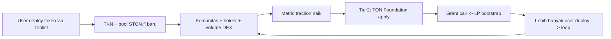

# Traction Bridge — launchpool sebagai prasyarat grant TON

> **Konteks:** model grant TON 2026 (Champion/Contender) menghargai **traction**. PLX saat ini masih tipis (~$34 LP, 9 holder). Sementara menunggu Tier 1 (STON.fi + cloud credits) cair, kita butuh **engine pertumbuhan** yang mengisi metrik traction — sehingga aplikasi TON Foundation (Tier 2) dapat diajukan dengan data yang lebih kuat.

## Apa itu "traction bridge"

Jalur yang mengubah **setiap pengguna toolkit** menjadi **metrik traction terukur** untuk grant:

## Mengapa launchpool/launchpad jadi engine

1. **Setiap deploy = 1 pool + community + volume** baru di TON. Ini menciptakan **network effect**: semakin banyak project, semakin kuat ekosistem.
2. **Milestone grant yang terverifikasi on-chain** (M1 LP bootstrap, M3 kontrak mainnet, M6 listing) lebih mudah dibuktikan saat ada aliran deploy yang konsisten.
3. Metrik yang **TIDAK bisa di-drive oleh grant saja**: volume DEX dan holder growth. Hanya bisa di-drive oleh **produk yang dikawal traction engine**.

## Metrik target (untuk mengisi form grant)

| Metrik | Baseline (2026-09) | Target sebelum apply TON Foundation | Cara ukur |
|--------|--------------------|-------------------------------------|-----------|
| On-chain holders | 9 | 100+ | TonAPI / Tonviewer |
| LP (pool) | ~$34 | $3K–$5K | Ston.fi + DexScreener |
| Volume 24h | ~0 | > $1K | DexScreener |
| Deployments via toolkit | 0 | 10+ | DB toolkit |
| Tonkeeper USD display | Belum | Aktif | Tonkeeper |

## Prasyarat milestone grant

Milestone di `docs/TON-GRANT-APPLICATION.md` bergantung pada traction bridge:

- **M2 (Tonkeeper USD):** butuh gate 100 TON LP + 100 holders → butuh traction.
- **M6 (listing CG/CMC):** butuh volume + LP + holders → butuh traction bridge.

Karena itu, eksekusi **Tier 1 dulu** (STON.fi grant yang tidak butuh traction + cloud credits untuk hemat biaya → alihkan ke LP) adalah **prasyarat** sebelum mengaktifkan traction bridge / launchpool engine penuh.

## Apa yang TIDAK akan dibangun di plan ini (scope)

Fitur launchpool/launchpad **tidak** diimplementasikan penuh di plan "TON Grants & Investor Acquisition" (scope = grants-first). Engine ini dicatat di sini sebagai **prasyarat milestone grant** dan harus menjadi inisiatif lanjutan.

---

*Dibuat: 2026-09-06. Menjadi catatan penunjang `GRANTS-INVESTOR-INDEX.md` dan `TON-GRANT-APPLICATION.md`.*
