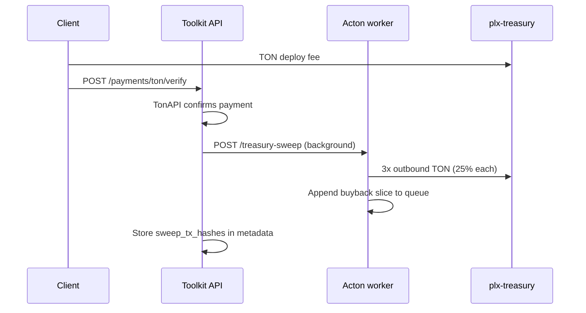
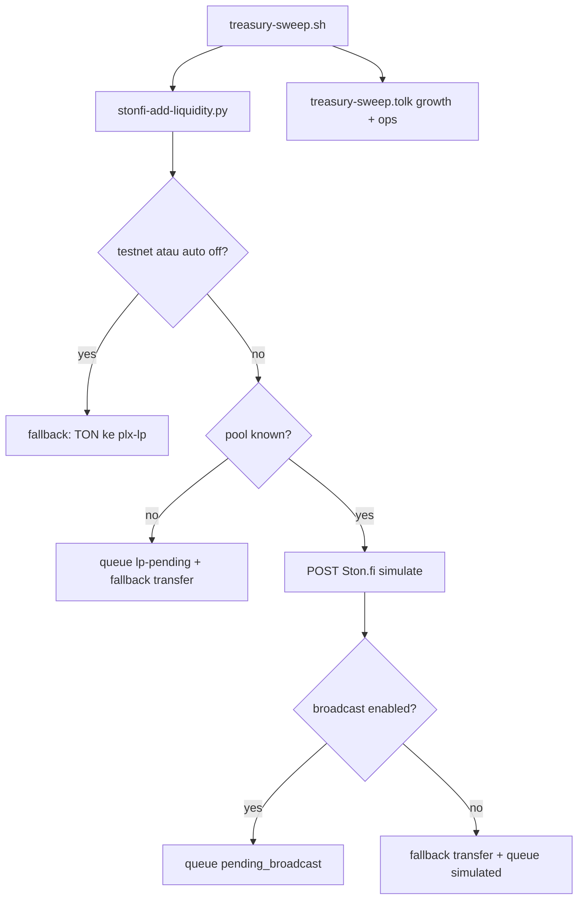

# Treasury Sweep — 25/25/25/25 Automation

Off-chain automation for **Phalanx Toolkit** deploy fees paid in **TON** (USDT phase 1b).
Does **not** modify `PaymentSplitter.tolk`. Does **not** sweep PLX jetton inflows from the splitter.

## Deteksi pembayaran client (bukan polling saldo)

Toolkit **tidak** memantau setiap TON masuk ke treasury. Sweep hanya jalan setelah client menyelesaikan alur wizard:

1. Client memilih tier (Standard 20 TON, dll.) dan rail **TON** atau **USDT**.
2. Client transfer dari wallet Tonkeeper ke **`plx-treasury`** (`TON_TREASURY_ADDRESS_MAINNET`).
3. Client memanggil **`POST /payments/ton/verify`** dengan `deployment_id`, `sender_address`, dan `rail`.
4. API memverifikasi via **TonAPI**: transfer dari **sender tersebut** ≥ **expected amount** (katalog pricing) ke treasury, window **20 menit**.
5. Jika match → `deployment.status = paid`, metadata: `sender_address`, `verified_at`, `tx_hash`.
6. Background task → `schedule_treasury_sweep()` dengan amount dari tier, **idempotency** via `sweep_tx_hashes` / `treasury_sweep_completed_at`.

Yang **tidak** trigger sweep:

| Sumber | Alasan |
|--------|--------|
| Transfer manual ke treasury | Tidak ada verify API + deployment_id |
| Rail **PLX** (PaymentSplitter) | Burn + treasury on-chain; jetton sweep after verify |
| **TestnetFree** | Tidak ada fee |
| **PayPal** | Fiat — accounting manual |
| Re-verify deployment yang sudah swept | Idempotency metadata |

Metadata audit setelah sweep: `treasury_sweep_payment_sender`, `treasury_sweep_payment_tx`, `treasury_sweep_lp`.

## Rails

| Rail | Inflow | Sweep? |
|------|--------|--------|
| **TON** | Native balance `plx-treasury` | Yes — automated 25/25/25/25 |
| **USDT** | USDT jetton wallet treasury | Hooked; automated split deferred (phase 1b) |
| **PLX** | PaymentSplitter → 50% burn + 50% PLX treasury | **Yes** — off-chain jetton sweep 20/15/15 of total fee |
| **PayPal** | Business fiat account | **No** — manual / accounting |

## Split (per verified deploy fee)

| 25% | Destination | Mainnet (EQ) |
|-----|-------------|--------------|
| Buyback | Queue → Ston.fi swap → burn | Retained in `plx-treasury` until cron |
| LP | `plx-lp` | `EQAiQ41f7R5qzKsoimbujtYdy0bRKW_7Fb0rV5Z4Lw6gr3zH` |
| Growth | `plx-marketing` | `EQDB9yVhkPvEhMFo90fqHWzqYj2mESAlwObMbA6LX7fETtN6` |
| Ops | PLX TOOLKIT wallet | `EQC5X2oWTI5NjFB9GIZ_8iWqGdhhiGsXY-SiLe42iZK4nvHK` |

Example: Standard tier **20 TON** → **5 TON** per bucket (3 outbound txs + 5 TON buyback queued).

## Trigger flow



**Idempotency:** `deployment.metadata_json` stores `sweep_tx_hashes` and `treasury_sweep_completed_at`. Re-verify does not double-sweep.

## Components

| File | Role |
|------|------|
| `scripts/treasury-sweep.tolk` | Sign 2 outbound transfers (growth + ops); buyback retained |
| `scripts/treasury-sweep.sh` | LP slice + acton sweep + buyback queue + JSON stdout |
| `scripts/stonfi-add-liquidity.py` | LP 25%: Ston.fi simulate → queue → fallback TON to `plx-lp` |
| `scripts/process-lp-queue.py` | Cron retry when `STONFI_POOL_ADDRESS` tersedia |
| `toolkit-staging/acton-worker/main.py` | HTTP worker: `/deploy`, `/treasury-sweep`, `/health` |
| `toolkit-staging/api/services/treasury_sweep.py` | API hook after TON verify (linked payment metadata) |
| `data/buyback-pending.json` | Buyback queue (server-local) |
| `data/lp-pending.json` | LP simulate/broadcast queue |

## Acton worker (Ubuntu)

On `dev@100.100.168.168:~/projects/plx-acton`:

```bash
export ACTON_WORKER_TOKEN="$ACTON_DEPLOY_TOKEN"
export ACTON_WORKER_HOST=127.0.0.1
export ACTON_WORKER_PORT=8787
python3 scripts/acton-worker.py
```

Expose via Tailscale Funnel / reverse proxy (same host as deploy):

- `POST https://phalanxdigital.taila5c428.ts.net/deploy` — client jetton deploy
- `POST https://phalanxdigital.taila5c428.ts.net/treasury-sweep` — fee split

Systemd example (`/etc/systemd/system/acton-worker.service`):

```ini
[Unit]
Description=PLX Acton HTTP worker
After=network.target

[Service]
User=dev
WorkingDirectory=/home/dev/projects/plx-acton
Environment=ACTON_WORKER_TOKEN=***
Environment=ACTON_WORKER_PORT=8787
ExecStart=/usr/bin/python3 scripts/acton-worker.py
Restart=always

[Install]
WantedBy=multi-user.target
```

## Ubuntu API / toolkit env

```env
TREASURY_SWEEP_ENABLED=true
ACTON_SWEEP_URL=https://phalanxdigital.taila5c428.ts.net/treasury-sweep
ACTON_DEPLOY_TOKEN=***
PLX_LP_ADDRESS_MAINNET=EQAiQ41f7R5qzKsoimbujtYdy0bRKW_7Fb0rV5Z4Lw6gr3zH
PLX_MARKETING_ADDRESS_MAINNET=EQDB9yVhkPvEhMFo90fqHWzqYj2mESAlwObMbA6LX7fETtN6
PLX_TOOLKIT_OPS_ADDRESS_MAINNET=EQC5X2oWTI5NjFB9GIZ_8iWqGdhhiGsXY-SiLe42iZK4nvHK
TON_TREASURY_ADDRESS_MAINNET=EQBBlAF4yz12NbrbKXYfGA1OsZzWFpkRj-TU6ciuYjBjK1aX
```

## Phase 2 — Buyback queue processor

```bash
# Cron every 15 min on acton server
*/15 * * * * cd ~/projects/plx-acton && bash scripts/process-buyback-queue.sh
```

Env when PLX/TON pool is live:

```env
STONFI_POOL_ADDRESS=<pool>
JETTON_MINTER_ADDRESS=EQCbaUJqiRIuw5U-A_tUYTK4mdH0L37oFMvxeMEDGE5nVfLS
STONFI_SWAP_ENABLED=true   # after swap integration tested
```

## Phase 3 — Ston.fi LP automation

Alur per sweep (25% slice ke LP):



**Testnet:** Ston.fi API mainnet-only → selalu fallback transfer ke `plx-lp`.

**Mainnet** (set di Acton worker host, bukan Railway):

```env
STONFI_LP_AUTO_ENABLED=true
STONFI_POOL_ADDRESS=<pool PLX/TON saat live>
STONFI_LP_BROADCAST_ENABLED=false   # true = queue router tx (Phase 3b)
PLX_JETTON_MINTER_MAINNET=EQCbaUJqiRIuw5U-A_tUYTK4mdH0L37oFMvxeMEDGE5nVfLS
```

Cron retry queue:

```bash
*/30 * * * * cd ~/projects/plx-acton && bash scripts/process-lp-queue.sh
```

Manual smoke:

```bash
export LP_TON_NANO=10000000 network=testnet DEPLOYMENT_ID=smoke-lp
python3 scripts/stonfi-add-liquidity.py
```

## PLX jetton sweep (PaymentSplitter rail)

After client pays in **PLX**, PaymentSplitter on-chain applies **50% burn + 50% to `plx-treasury`**. The toolkit then sweeps the treasury slice off-chain:

| Share of total fee | Share of treasury slice | Destination |
|--------------------|-------------------------|-------------|
| 20% (LP) | 40% | `plx-lp` jetton wallet |
| 15% (growth) | 30% | `plx-marketing` jetton wallet |
| 15% (ops) | 30% | PLX TOOLKIT ops jetton wallet |

Example: **10 PLX** Standard fee → 5 PLX burned on-chain, then sweep **2 + 1.5 + 1.5 PLX** jetton from `plx-treasury`.

**Verify target:** client transfer goes to **PaymentSplitter jetton wallet** (`PLX_SPLITTER_JETTON_MAINNET=EQBCSpxj6uWf2ihEfr5a4YQnXQff_Q-qoh7R6WwHrOIR7nQW`), not the splitter contract address.

**Idempotency:** `plx_sweep_completed_at` / `plx_sweep_tx_hashes` in deployment metadata.

| File | Role |
|------|------|
| `scripts/plx-treasury-jetton-sweep.tolk` | Sign 3 jetton transfers from `plx-treasury` |
| `scripts/plx-treasury-jetton-sweep.sh` | Compute 40/30/30 splits + JSON stdout |
| `toolkit-staging/api/services/plx_payment_verify.py` | TonAPI verify to splitter jetton wallet |
| `toolkit-staging/api/services/plx_treasury_sweep.py` | Background hook → `POST /plx-treasury-sweep` |
| `toolkit-staging/acton-worker/main.py` | Worker endpoint `/plx-treasury-sweep` |

Env (Ubuntu API `.env` via deploy-api-acton.ps1):

```env
PLX_SPLITTER_JETTON_MAINNET=EQBCSpxj6uWf2ihEfr5a4YQnXQff_Q-qoh7R6WwHrOIR7nQW
PLX_TREASURY_SWEEP_ENABLED=true
ACTON_PLX_SWEEP_URL=https://phalanxdigital.taila5c428.ts.net/plx-treasury-sweep
```

## Verification checklist

1. Testnet/mock: paid deployment → sweep metadata populated
2. Mainnet smoke: 1 TON Standard deploy → 4×5 TON logical split
3. Double verify → no duplicate `sweep_tx_hashes`
4. PLX rail deploy → `plx_sweep_tx_hashes` populated (not `sweep_tx_hashes`)
5. After Phase 2: queue entry → `burned` status + supply decrease

## Audit

All outbound txs from `plx-treasury` are visible on [Tonviewer](https://tonviewer.com). Quarterly reports: `docs/TREASURY-REPORT-YYYY-Qn.md` (see `docs/TOKENOMICS.md`).
