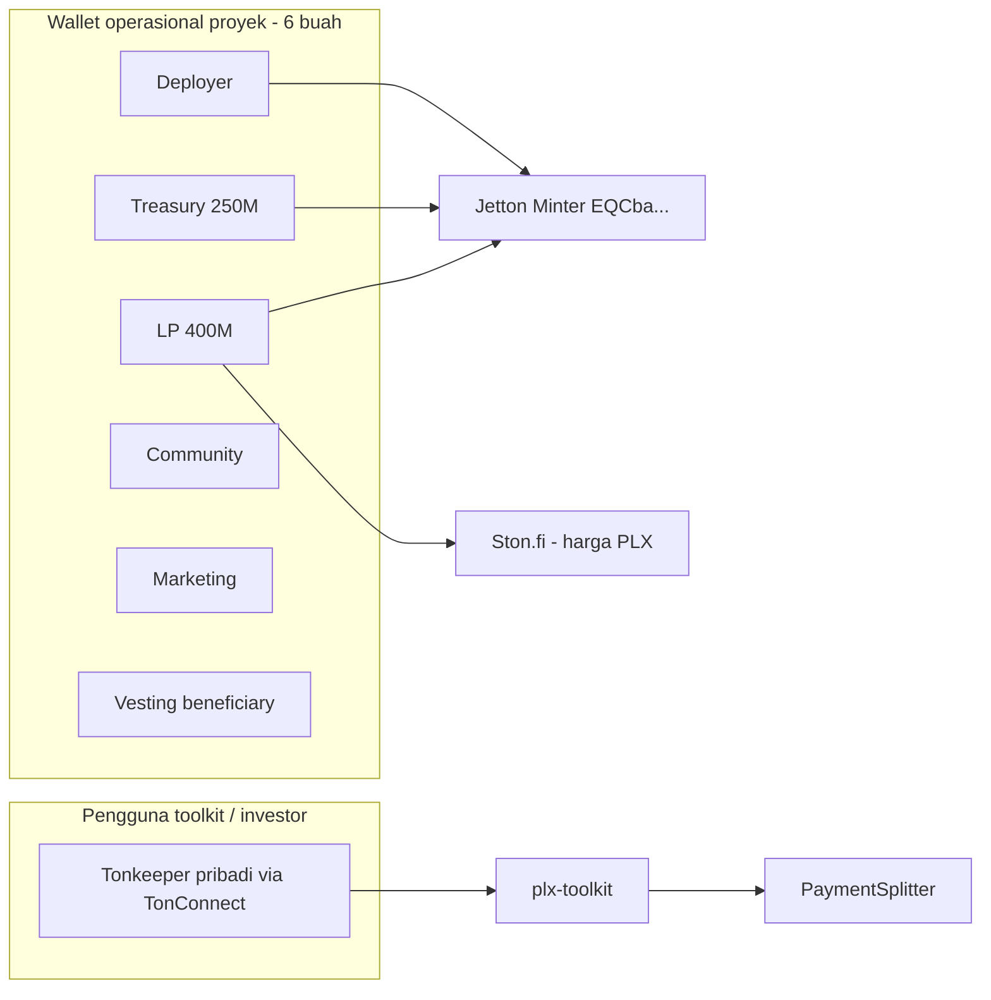

# Wallet asli proyek & harga PLX

> Untuk operator Phalanx — bukan sekadar “lihat” PLX di app, tapi **mengontrol** dana dan **mendapat harga** di pasar.

---

## Fakta penting: proyek **sudah** pakai wallet asli

Enam dompet mainnet dibuat dengan `acton wallet new --version v5r1`. Masing-masing punya **24 kata sendiri** — itu dompet TON **sesungguhnya** on-chain, bukan simulasi.

| Peran | Nama di server Acton | PLX genesis | Kunci ada di |
|-------|---------------------|-------------|--------------|
| Deployer / admin minter | `plx-deployer-v2` | 0 | `wallets.toml` server |
| Treasury | `plx-treasury` | 250M | sama |
| LP | `plx-lp` | 400M | sama |
| Community | `plx-community` | 200M | sama |
| Marketing | `plx-marketing` | 50M | sama |
| Vesting beneficiary | `plx-vesting-beneficiary` | 0 (100M di kontrak) | sama |

Alamat lengkap: [`MAINNET-DEPLOYMENT-RECORD.md`](MAINNET-DEPLOYMENT-RECORD.md).

**Yang belum “asli” di pengalaman Anda biasanya bukan kontrak**, melainkan:

1. Kunci hanya di server — belum di HP (Tonkeeper) untuk **sign** transaksi.
2. PLX belum punya **harga** — belum ada pool likuiditas (LP).
3. Label SCAM — verifikasi Tonkeeper, bukan masalah wallet.

---

## Apa yang **tidak bisa** diubah tanpa biaya besar

| Harapan | Kenyataan |
|---------|-----------|
| “Ganti treasury ke wallet pribadi baru” | 250M PLX **sudah** di `plx-treasury` — harus **transfer jetton** + update PaymentSplitter / docs / toolkit |
| “Redeploy supaya pakai seed Tonkeeper saya” | Supply sudah 1B di minter live — redeploy = kontrak **baru**, bukan perbaikan yang sama |
| “Agent buat wallet baru yang lebih asli” | Wallet baru = alamat baru = PLX **tidak pindah otomatis** |

**Proyek sudah terikat ke enam alamat EQ/UQ di atas.** Menggunakan wallet asli = **menggunakan kunci enam dompet itu**, bukan mengganti alamat.

---

## Cara membuat proyek “pakai wallet asli” di praktik

### Tahap 1 — Pastikan Anda **mengontrol** enam dompet (Tonkeeper)

Jika di Tonkeeper sudah ada 6 wallet `UQ…` yang cocok tabel deploy → **Anda sudah di tahap ini.**

Jika belum:

1. SSH: `dev@100.100.168.168` → `~/projects/plx-acton`
2. Export mnemonic per wallet (interaktif):  
   `acton wallet export-mnemonic plx-treasury` (dan 5 lainnya)
3. Import di Tonkeeper **mainnet** (bukan Testnet Account)
4. Verifikasi alamat: `acton script scripts/print-addrs.tolk --net mainnet`

Panduan: [`TONKEEPER-CARA-CONNECT.md`](TONKEEPER-CARA-CONNECT.md).

**Setelah import:** transaksi treasury/LP/LP **ditandatangani dari HP Anda** — itu “wallet asli sesungguhnya” untuk operasi.

### Tahap 2 — Ops dari server (tanpa HP)

Server memakai **file kunci yang sama** (`wallets.toml`). Perintah:

```bash
acton script scripts/drop-admin.tolk --net mainnet
acton script scripts/send-ton.tolk --net mainnet
```

Ini **bukan** wallet palsu — hanya penyimpanan kunci di Ubuntu, bukan di Tonkeeper.

### Tahap 3 — Agar PLX punya **harga** (bukan custom token)

**Hanya setelah** TonAPI `verification: whitelist` (PR ton-assets merge). Jangan LP saat masih SCAM — lihat [`AKUNTABILITAS-SCAM-DAN-LP.md`](AKUNTABILITAS-SCAM-DAN-LP.md).

Harga muncul di DEX setelah **likuiditas**:

| Langkah | Wallet | Modal |
|---------|--------|-------|
| 1 | Buka **plx-lp** di Tonkeeper (400M PLX) | + **TON** untuk pair (mis. 50–500 TON, keputusan Anda) |
| 2 | [Ston.fi](https://app.ston.fi) atau DeDust → Create pool | Jetton: minter `EQCbaUJqi…` |
| 3 | Add liquidity | PLX + TON dari wallet LP |

Tanpa langkah ini, PLX **memang** tidak punya harga pasar — itu normal untuk token baru, bukan karena wallet salah.

**SCAM label** tidak menghalangi Anda membuat pool; bisa membuat investor ragu — tetap kejar PR [#5468](https://github.com/tonkeeper/ton-assets/pull/5468).

### Tahap 4 — Toolkit & situs (alamat publik)

Semua yang menampilkan treasury/minter ke user harus pakai alamat **mainnet** dari [`MAINNET-DEPLOYMENT-RECORD.md`](MAINNET-DEPLOYMENT-RECORD.md), bukan alamat testnet `kQ…`.

- Pembayaran toolkit → PaymentSplitter `EQBC3QoFri…`
- Rail PLX → minter `EQCbaUJqi…`
- End-user connect → **TonConnect** (wallet pribadi mereka), **bukan** mengganti treasury proyek

---

## Dua jenis “wallet” dalam ekosistem



| Jenis | Untuk apa | Ganti? |
|-------|-----------|--------|
| 6 wallet ops | Genesis, treasury, LP, marketing | Hanya dengan transfer on-chain + update konfig |
| Wallet pribadi user | Bayar toolkit, hold PLX sendiri | Bebas — tidak mengganti treasury |

---

## Checklist “proyek pakai wallet asli”

- [ ] Enam alamat Tonkeeper = tabel [`MAINNET-DEPLOYMENT-RECORD.md`](MAINNET-DEPLOYMENT-RECORD.md)
- [ ] Mnemonic enam wallet di-backup offline (bukan hanya di server)
- [ ] Transaksi penting (LP, transfer besar) dari Tonkeeper **plx-lp** / **plx-treasury**
- [ ] Pool Ston.fi dibuat → PLX punya harga referensi
- [ ] PR ton-assets merge → label SCAM hilang (bukan syarat LP, tapi untuk kepercayaan)
- [ ] Opsional: `drop-admin` dari deployer → supply tidak bisa di-mint lagi

---

## Ringkas

| Pertanyaan | Jawaban |
|------------|---------|
| Apakah wallet proyek palsu? | **Tidak** — W5 mainnet live, PLX sudah di alamat itu |
| Bagaimana “pakai wallet asli”? | Import / kuasai **24 kata** enam dompet; jangan buat wallet baru untuk ganti peran |
| Kenapa PLX tidak ada harga? | Belum LP — pakai wallet **plx-lp** + TON di Ston.fi |
| Custom token di Tonkeeper? | Hanya tampilan; **bukan** pengganti LP atau wallet ops |

Bantuan langkah demi langkah import: [`TONKEEPER-CARA-CONNECT.md`](TONKEEPER-CARA-CONNECT.md).
